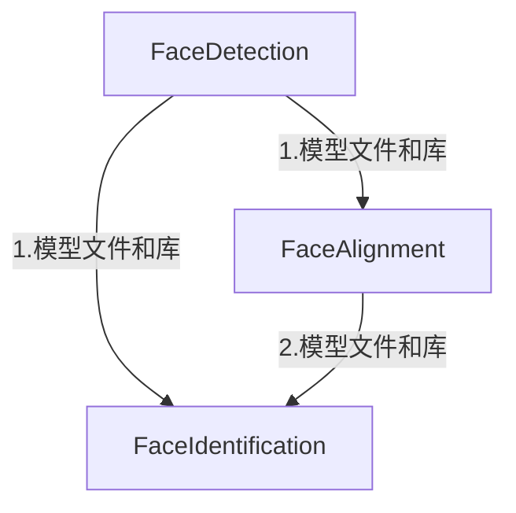

##SeetaFace
[TOC]

### 基础

#### 目录结构

FaceAlignment     

FaceDetection     

FaceIdentification

LICENSE          

README.md   

##### FaceDetection

- 人脸识别模块，用于识别出照片中的人脸，染回每个人脸的坐标和人脸总数。

##### FaceAlignment

- 特征点识别模块，主要识别两个嘴角、鼻子、两个眼睛五个点的坐标。测试下来，发现图片模糊时，识别不准。

##### FaceIdentification

- 人脸比较模块，根据官方的说法，先提取特征值，然后比较。给出的测试程序是seetaface提取人脸的特征值和caffe训练库里的人脸做对比。

#### 依赖关系



1. **FaceDetection模型文件和库**

- seeta_fd_frontal_v1.0.bin
- libseeta_facedet_lib.so
- 可执行文件：facedet_test

2. **FaceAlignment模型文件和库**

- seeta_fa_v1.1.bin
- libseeta_fa_lib.so
- 可执行文件:fa_test

3. FaceIdentification的模型文件和库

- seeta_fr_v1.0.bin
- libviplnet.so.4.5
- 可执行文件：test_face_recognizer.bin和test_face_verification.bin

#### 安装

注意以下的边编译把FaceDetect测试程序也编译了，而测试程序是依赖opencv的，所以，在这之前，确认opencv是否安装

##### 安装SeetaFace Detection

```shell
cd FaceDetection   
mkdir build 
cd build
cmake -DOpenCV_DIR=/usr/local/opencv/share/OpenCV/  ..
make

#### 生成结果如下：
可执行文件：facedet_test
动态库文件：libseeta_facedet_lib.so 
```

##### 安装 SeetaFace Alignment

然后将FaceDetection中的/include/face_detection.h和/build/libseeta_facedet_lib.so 拷贝到/FaceAlignment/build文件夹下，为了生成test example


##### 安装SeetaFace Indentification

编译之前，以下工作需要做：

1. 将前两步生成的libseeta_facedet_lib.so 和libseeta_fa_lib.so库文件放置在build目录下，并修改src/test/CMakeLists.txt文件，在Cmakelists文件中添加查找的链接库link_directories(${PROJECT_BINARY_DIR})(也就是在当前build文件夹下查找，该命令最好添加循环函数外边) ，并修改target_link_libraries(XXXXX seeta_facedet_lib seeta_fa_lib)，状态如下：

```cmake
#`src/test/CMakeLists.txt`修改之后如下
aux_source_directory (. SRC_LIST)

message(${SRC_LIST})
link_directories(${PROJECT_BINARY_DIR}) #添加lib的目录

# add external libraries
find_package(OpenCV REQUIRED)

enable_testing ()
foreach (f ${SRC_LIST})
  string(REGEX REPLACE "[.]cpp" ".bin" BIN ${f})
  add_executable(${BIN} ${f})
  target_link_libraries(${BIN} viplnet ${OpenCV_LIBS}  seeta_facedet_lib seeta_fa_lib) #添加lib
endforeach ()
```

2. 解压缩model下的两个压缩文件，得到seeta_fr_v1.0.bin模型文件
3. face_alignment.h, face_detection.h: No such file or directory,出现这个的原因是sample在编译是需要用到这些头文件。解决方法，将SeetaFaceEngine/FaceDetection/include/face_detection.h和SeetaFaceEngine/FaceAlignment/include/face_alignment.h拷贝到SeetaFaceEngine/FaceIdentification/include/文件夹中，或者修改当前目录下的./CMakeLists.txt

```cmake
cmake_minimum_required (VERSION 2.6)

project (viplnet)

set (VIPLNET_VERSION_MAJOR 4)
set (VIPLNET_VERSION_MINOR 5)

set(CMAKE_BUILD_TYPE "Release")
set(CMAKE_CXX_FLAGS_DEBUG "${CMAKE_CXX_FLAGS} -std=c++11 -O2 -g -ggdb")
set(CMAKE_CXX_FLAGS_RELEASE "${CMAKE_CXX_FLAGS} -std=c++11 -O2")

MESSAGE(STATUS "other platform: ${CMAKE_SYSTEM_NAME}")

if (CMAKE_SYSTEM_NAME MATCHES "Darwin")
    set(CMAKE_CXX_FLAGS_DEBUG "${CMAKE_CXX_FLAGS_DEBUG} -DGTEST_USE_OWN_TR1_TUPLE=1")
    set(CMAKE_CXX_FLAGS_RELEASE "${CMAKE_CXX_FLAGS_RELEASE} -DGTEST_USE_OWN_TR1_TUPLE=1")
endif (CMAKE_SYSTEM_NAME MATCHES "Darwin")

set(VIPLNET_INCLUDE_DIR ${PROJECT_SOURCE_DIR}/include)
set(VIPLNET_SRC_DIR ${PROJECT_SOURCE_DIR}/src)
# set __VIOL_LOG__ macro
# add_definitions(-D__VIPL_LOG__)

include_directories(${VIPLNET_INCLUDE_DIR})
include_directories(${VIPLNET_SRC_DIR})
include_directories(../FaceDetection/include) # 添加头文件
include_directories(../FaceAlignment/include) # 添加头文件

add_subdirectory(src)

aux_source_directory(./src SRC_LIST)
aux_source_directory(./tools TOOLS_LIST)
add_library(viplnet SHARED ${SRC_LIST} ${TOOLS_LIST})
set_target_properties(viplnet PROPERTIES 
  VERSION ${VIPLNET_VERSION_MAJOR}.${VIPLNET_VERSION_MINOR} 
  SOVERSION ${VIPLNET_VERSION_MAJOR}.${VIPLNET_VERSION_MINOR}) 
```

4. 分别修改`test_face_recognizer.cpp`和`test_face_verification.cpp`中**data和model的相对路径**，还要修改`test_face_verification.cpp`文件中查找之前编译过得模块的路径

```
这里查看源码就好了，自己做出相应的调整
```

#### 测试

##### 人脸检测测试

```shell
cd FaceDetection/build
./facedet_test 
Usage: ./facedet_test image_path model_path
# 示例
./facedet_test test.jpg ../model/seeta_fd_frontal_v1.0.bin
# 会弹出图相框，显示标注出的人脸（蓝色矩形框）
```

##### 人脸对齐测试

```shell
cd FaceAlignment/build
./fa_test
# 示例
./fa_test
# 该程序会读取../data/image_0001.png,并将检测和对齐的结果保存在当前目录result.jpg，显示的红框标注人脸位置，五个绿色点标注特征点
```

##### 人脸识别测试

```shell
cd FaceIdentification/build/src/test

#人脸识别
./test_face_recognizer.bin

# 人脸比对
./test_face_verification.bin
```

关于识别：

```
这部分相对麻烦，需要看源码，有三个单元测试的代码
```

关于比对：


> 比对是判断两个文件中的人脸的相似度，相似度大于0.7的可以认为是同一个人.注意此处要求每张图像中只有一张人脸，否则无法比对

 ##参考

[SeetaFaceEngine官方Github]( https://github.com/seetaface/SeetaFaceEngine)

[SeetaFaceEngine安装和测试](http://blog.csdn.net/u012235003/article/details/54576923)

[Linux中编译开源人脸识别引擎SeetaFace](http://blog.csdn.net/u012336567/article/details/52746024)

[SeetaFace编译](http://blog.csdn.net/wuzuyu365/article/details/52574365)

[开源人脸识别引擎SeetaFace入门教程（一）](https://segmentfault.com/a/1190000006972629)