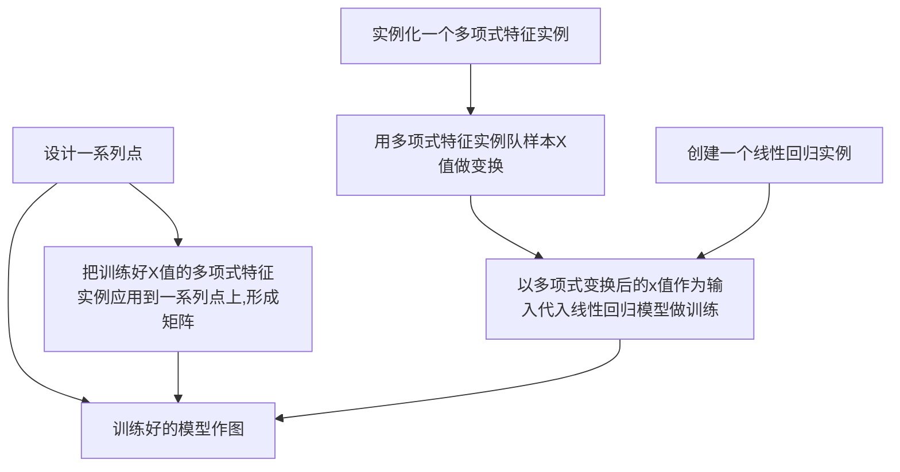

## 线性回归问题

[TOC]

### 一元线性回归

### 多元线性回归

一个因变量和多个自变量有关，比如一个商品的价格和原料价格、加工方法、上市时间、品牌价值等有关，也就是多元线性。

> 要判断是否存在多元线性的关系？

## 多项式回归

多元真实情况未必是线性的，有时需要增加指数项，也就是多项式回归，显示时间的曲线关系都是通过增加多项式实现的。

### 一元多项式回归

$y=a(n)x^n+a(n-1)x^(n-1)+…+a(1)x+a(0)$

> 一个变量和另一个变量存在着多项式的关系

房屋面积和价格的关系：

| 样本   | 面积(平方米) | 价格(万元) |
| ---- | ------- | ------ |
| 1    | 50      | 150    |
| 2    | 100     | 200    |
| 3    | 150     | 250    |
| 4    | 200     | 280    |
| 5    | 250     | 310    |
| 6    | 300     | 330    |

```python
# 先用面积和房价做训练和拟合
xx = [[50],[100],[150],[200],[250],[300]]
yy = [[150],[200],[250],[280],[310],[330]]

# 用另外两个点做测试
X_test = [[250],[300]] # 用来做最终效果测试
y_test = [[310],[330]] # 用来做最终效果测试

```

多项式拟合的流程；

```python
0.# 设计x轴一系列点作为画图的x点集
xx = np.linspace(30, 400, 100) 

1.# 实例化一个二次多项式特征实例
quadratic_featurizer = PolynomialFeatures(degree=2) 

2.# 用二次多项式对样本X值做变换
X_train_quadratic = quadratic_featurizer.fit_transform(X) 

3.# 把训练好X值的多项式特征实例应用到一系列点上,形成矩阵
xx_quadratic = quadratic_featurizer.transform(xx.reshape(xx.shape[0], 1)) 

4.# 创建一个线性回归实例
regressor_quadratic = LinearRegression()

5.# 以多项式变换后的x值为输入，训练线性回归模型
regressor_quadratic.fit(X_train_quadratic, y) 

6.# 用训练好的模型作图
plt.plot(xx, regressor_quadratic.predict(xx_quadratic), 'r-') 
```

流程图如下：




## 参考

[用scikit-learn解决一元线性回归问题](http://www.shareditor.com/blogshow/?blogId=53)

[用scikit-learn解决多元线性回归问题](http://www.shareditor.com/blogshow/?blogId=54)

[线性回归（Linear Regression）算法](http://blog.csdn.net/suipingsp/article/details/42101139)（该作者的机器学习算法详解系列不错）

[用scikit-learn解决多项式回归问题](http://www.shareditor.com/blogshow/?blogId=56)


