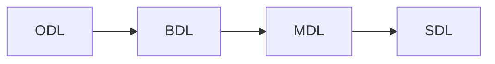

##数据组学习计划
[TOC]

### 总章

#### 学习计划

{:height="20px" width="150px"}

##### 技能积累


##### 数据意识

###### 数据体系

做数据工作，不论是数据分析、数据开发还是数据挖掘工作，要树立三个体系的意识：

- 业务逻辑体系(最重要)
- 计算体系
- 报表和指标体系

###### 数据本质

数据是由信息落地产生的，数据的本质是用来消除或降低不确定性。

###### 数据价值

数据的价值体现在两方面：

- 驱动决策
- 驱动产品智能

决策主要牵涉到统计学知识，而产品智能则主要涉及机器学习和人工智能，这也是数据分析的两个不断的发展方向。

#### 数据现状

数据现状如下：

- 需求排队等待数据工程师从繁杂混乱的数据中进行整理完成
- 只有宏观的仪表盘数据，无法进行细分
- 各业务线的数据彼此独立，存在数据孤岛，没有统一管理

解决这个问题的方式是建立数据集市（DataWarehouse），进行统一管理，然后在此基础上搭建自助分析平台，进行必要的辅导后，让业务需求提出者能够通过该平台进行进行自助式地完成数据分析需求。而数据工程师的精力主要体现在搭建这套平台上，涉及数据埋点接入、数据传输、数据存储/建模、底层数据统计等ETL和仓库建模方面。而且随着开源技术的不断成熟，数据工程师在这些方面的需求也会不断弱化，而分析能力、数据挖掘等才是数据分析师的核心竞争力所在。

#### 整体流程

##### 数据仓库

数据仓库不仅仅是指数据接入、数据存储和数据计算，它也要包括数据治理、数据建模和数据挖掘。比如元数据管理、维度建模和 OLAP 分析，这些都是我们在建设数据仓库时候要考虑的内容。 

{:height="120px" width="150px"}


##### 业务体系


#### 注意事项

- 业务方的主动沟通了解，了解业务侧改动的出发点，从而更好的设计埋点和后续的数据分析
- 团队融入和主动性，一个人的力量终极是有限的，有时候别人无意中的几句话就能带来很大的启发
- 多出数据分析报告，即使简单的数据分析也要写分析报告，这样能锻炼自己的分析思维

##### 职业发展

​	数据体系的重头戏是ETL，搞半年或者一年来了解下大致的业务和技能就可以了，但是不能长期搞ETL，因为开源平台越来越成熟，这样会弱化自己的技术深度，要投入足够的时间来进行==数据仓库、数据挖掘或者核心平台==层面的工作。要经常反思自己是否有成长，核心竞争力是否有所体现。

##### 紧跟业务

切记不要以为可以完全脱离业务去做一套数据仓库，我们可以在数据仓库的某个层次不以业务需求为导向来设计，但是最终面向业务的数据一定会是和业务理解有关 

##### 提前规划

###### 数据仓库规划

表和字段命名等，中间层的抽取

###### 数据质量管理

1. 核心数据每日数据量级监控和告警
2. 重要业务指标监控和告警
3. 主要业务流程各阶段数据的监控和告警

### 数据采集

#### 源类型

数据源格式:

- 在线文件系统(csv,txt格式)

- nginx等日志格式

- 线上数据库（mysql,orcale）


step1:利用同步工具接入到数据仓库ODS层

step2:然后进行ETL转化（数据抽取、转换和加载）形成完备的数据仓库体系

step3:数据统计和分析

##### 文件系统

###### table格式

现成的csv,txt或者导出的其它结构化的格式

###### k-v格式

此处主要是指json、yaml、xml、html等格式化标记

##### 日志格式

nginx日志格式

```nginx
14.152.49.250 - - [31/Oct/2017:11:02:00 +0800] "GET /owncloud/index.php HTTP/1.1" 200 3898 "http://alsite.com/owncloud/" "Mozilla/5.0 (Windows NT 10.0; Win64; x64) AppleWebKit/537.36 (KHTML, like Gecko) Chrome/61.0.3163.100 Safari/537.36"

# 参考自写的awk程序解析
```

日志格式主要工作在于抽取成table格式，因为现在使用的数据库一般都是关系型数据库，其数据是table格式的

##### 数据库

线上业务数据最常用的mysql、redis等数据加入分析和采集的源头

#### 数据埋点

数据埋点埋的就是元数据，十分特别很极其重要，合理设计的元数据会为后面的建模、统计分析、后续扩展、甚至优化维护等都会带来极大的便利，无论如何强调都不为过。

另外要强调的是埋点不是仅为了产品而服务的，埋点首先需要涵盖产品的需求，此外还有数据人员根据当前的业务逻辑，根据实际情况判断是否要添加新的埋点，从而完善整个逻辑，从这个角度来看，埋点也是为数据人员自身服务的。

##### 界面交互

在埋点文档中处理页面交互流，页面之间的跳转关系等，帮助提升埋点技术，避免埋点疏漏

###### 产品结构

###### 页面流程

页面的跳转逻辑

###### 埋点需求

根据页面流程和交互，提出埋点需求

##### 埋点分类

从位置上分为前端埋点和后端埋点

###### 前端埋点

前端是在用户端(APP、Web、客户端)等嵌入数据采集代码进行埋点，比如友盟等均采用的是前端埋点。

前端埋点能手机到用户在界面上的操作归结，这些数据后端是没法收集的，比如用户点了哪个按钮、页面之间的跳转次序等。

前端埋点技术有以下三类：

代码埋点

```
代码埋点的优点是控制精准，采集的数据项精确。缺点：首先是需要开发人员到处添加采集代码，添加和修改的工作量大；其次变更采集策略，需要发布新版本，代价巨大；此外对于APP来说还有耗电、消耗数据流量、丢失数据的风险。
```

可视化埋点

```
有的公司开发出了可视化埋点技术，产品与运营人员通过GUI界面，鼠标点击的方式随时调整埋点位置，增加、取消埋点，再也不需要开发人员的介入，而且不用发布新版本

基本原理就是将埋点位置信息做成可配置的资源，通过在后台管理端上操作生成这些配置，客户端启动或者定时从服务器端获取这些配置，客户端根据最新的配置采集数据，发送给服务端。

具体实现是SDK定时做界面截图，在截图的同时从界面UI的根对象开始遍历所有的可视化子对象，得到其层级关系。根据截图和UI元素的可视化信息重新渲染页面，识别可埋点的控件。当产品人员在后台管理端的截屏画面上点击可埋点控件，设置事件关联方面的配置，服务器保存这些配置，客户端在获取到这些配置信息以后，按照新配置采集数据。

可视化埋点技术参考：https://github.com/mixpanel
```

无埋点

```
原理跟可视化埋点几乎一样，唯一的不同就是，无埋点是先把所有控件的操作数据采集下来，发给服务器，数据分析人员在后台管理端设置对哪些数据进行分析。由此可知，这个方案收集的数据量巨大，增加了网络传输和服务器存储负担。

无埋点比可视化方案优势的地方是收集的历史数据齐全，可以回溯分析过往数据
```

###### 后端埋点

后端埋点为了避免前端埋点的以下问题：

- 客户端采集数据，为了尽量减少对用户体验的影响，需要对采集的数据压缩、暂存，为减少移动端的数据流量，一般只在网络状况良好的情况下向服务器发送数据，因此数据会有延迟，丢数据等弊端。而在服务端采集数据，数据在内网传输，数据传输的即时性强，丢失数据的风险小。
- 客户端采集数据，如果要增加采集点或变更采集方案，需要修改客户端代码，这就需要发布新版本，受发布周期的影响，而且通常很多用户并不会及时更新版本，将导致新方案不能覆盖所有用户。在服务端采集数据则没有这些问题。

实时的时候尽量采用后端埋点，除非后端无法采集到所需要的数据。

#### 埋点技术

##### 埋点思维

数据埋点的本质是元数据管理，核心是处理行为、位置和模块之间的关系，找到最合适的元数据组织管理方式。

###### 漏斗思维

漏斗思维即分阶段思维，是从流水线的角度考虑问题，存在因果。

- 同一事件的不同阶段

事件名贯穿，然后不同的阶段名进行区分，同时不同的阶段之间要有串连字段，用以分析整个流程

- 同一事件的不同平台的衔接

要有漏斗思维，统计的是整个链条，每个环节要考虑各种维度的数据是否采集到，入口要做统计，出口也要统计，形成一个完整的链条，客户端的分享要统计到，分享出去的页面的展现和点击也要统计到，做好跨平台之间的信息透传，避免链条中断或者模糊，此处经常体现在用户身边标示的传递和分享来源ref的传递。

- 有开始有终点

要有整套的完整流程，不能缺失关键环节，比如有启动的foreground，就应该有切后台的backgroud，甚至要有被杀死的killdone事件（注意此事件要进行实时上报，不然归结到其它不确定的日期分区，会造成匹配起来特别麻烦）

以弹窗的上报为例：

1. xxx_pop_pv
2. xxx_pop_show
3. xxx_pop_click
4. xxx_pop_result


###### 层次思维

层次思维的设计常常用来处理浮层，母页面的展现和点击要和浮层页面的展现和点击要从设计上进行直观的区分，此外浮层界面的展现往往不报，而是等效于母页面上元素的点击，其思维本质类似于埋点准则中的事件上卷

此外，层次思维在处理浮层问题的时候，最多处理两层，超过两层就应该是产品的交互问题了，不在此考虑范围呢

###### 流思维

数据流的统计，首先要了解刷新的业务流程，要考虑的是刷新的次数，每次刷新新增的数据，新增的数据是如何和老数据进行融合展示的

###### 扩展思维

扩展思维其实是抽象思维的一种体现，越抽象的事物越容易扩展。

设计的数据埋点要能方便的进行扩展，对将来可能出现的扩展情况要能做出预判,尽量避免做成一次性的东西，此外扩展格式设计的时候要不影响已有数据的原始处理逻辑，表现在埋点上尽可能的采用增加属性和属性值的方式进行埋点，避免一大堆不可复用的垃圾事件，增加管理的难度。

具体的措施如下：

- 采用字典的方式进行埋点,尽量不要采用分隔符分割的列表方式，例如:vid1_vid2_vid3
- 对可能出现的逻辑进行顶层设计区分,在每层上同样采用字典的方式
- 对多个事件引用的同一属性的枚举值，建议用表分割出来，不要在每个事件上一个个地修改
- 卡片类等点击内容可能多个的情况，在设计之初就应该有clickid属性用以区分点击的具体位置
- 针对点击事件的针对性，比如针对某条评论的点击恢复，点赞等，在点击事件中要设计针对属性

点击事件设计：

| attribute1 | extdata                                  |
| ---------- | ---------------------------------------- |
| xxx_click  | clickid:点击的具体位置                          |
|            | objectid:对象id(点击对象的属主,需要的时候才上报)，例如短视频是视频id,评论时评论id |
|            | result:点击结果，比如点击关注，则报关注的结果（此事件若不能在此时上报，则分开） |
|            |                                          |
|            |                                          |

> 其它的属性根据需要扩展，比如悬浮球的统计，就有点击时悬浮球的状态

###### 抽象能力

有对业务的扩展有预见性，比如手雷内容发布，最初只有短视频内容，结果设计的时候直接设计成shortvideo_publis_xxx代表各个阶段，这让以后的上报如何扩展，是兼并，还是排除??

分享扩展：


埋点抽象和层级关联之间要平衡，因为目前的 自定义查询表无法做到层级关联的查询。

###### 行为分类

行为分类主要处理的用户和app提供的内容之间的交互，比如曝光/点击/消费(播放、下载、阅读等)/评论/点赞/分享/收藏等，在重点行为上，要进行合理的设计，才能在后期进行良好的扩展。比如按位置的短视频曝光、点击、播放、评论、分享、收藏等，若前期在埋点的时候没有考虑到，统计层的代码会写得混乱不堪。为此特设计这些行为的from的position属性，其中from属性是该行为消费的前置，position是该行为消费的位置，若在消费的过程中from和position发生了变化(主要是position的变化)，则要记录消费行为开始和结束时对应属性的状态，并且在事实表层保留这种状态变化(严格杜绝只保留其中一种状态)。以播放行为来举例：


==重点强调：==

> 行为和位置及来源属性是强绑定的，由于设计的改版主要是基于交互界面的，而交互界面的承载就是位置和来源，衡量实验的结果其实就是衡量某种行为的结果，如果无法对行为的位置和来源属性进行细分，就无法对结果做出评价，所以行为要强绑定位置和来源属性，而且各种行为的位置和来源属性的命名上要统一。

播放行为

```
从各个位置的产生的播放都统一走播放行为统计事件（产生播放的位置太多了）
```

下载行为

```
产生下载的行为的位置相对较少，主要是from的层级结构进行划分
```

<!--关注行为-->

```
当关注的入口很多的时候，就需要在上报层进行区分，这样可以减少后面的统计代码的修改
```

> 备注：
>
> - 注意上报关注行为的关注结果，关注行为的点击散布在各个页面的点击事件中，如若统计整体的关注数据就相对麻烦，需要有统一的规则。如果统计将关注行为抽取出来，则在统计某个页面的点击的时候，就需要将该页面关注的点击和其它行为的点击连接在一起（这种情况相对少见）
> - 解决方案：
>   - 将关注行为抽象出来，有关注的点击和关注结果两个事件
>   - 在各个页面分别上报，但是上报事件的名称都一样，只是extdata上进行区分（方便按位置的查找）

<!--点赞行为-->

```
点赞行为和关注行为类似，但甚至更粗糙，甚至没有点赞的结果返回
```

搜索行为

```shell
搜索行为的入口也相对单一，可以不从行为角度进行上报汇聚
```

评论行为

```
如果评论的地方比较多，可以放在一处
```

分享行为

```
如果分享的地方比较多，要对分享行为放在一起进行处理
```

弹窗形式

```
抽取出公共弹窗事件(在业务过程中触发，但是又相对独立于业务)，然后再对弹窗进分类，比如授权弹窗，提醒弹窗，引导弹窗、登录弹窗等，但要注意的是与业务和流程紧密结合的弹窗并不适合剥离，需要根据实际的情况确定，
```

> 备注：登录是个大的行为事件，登录弹窗建议放到按行为分类的登录sheet里，难点还是在于处理弹窗前后的逻辑上，若逻辑简单就放到弹窗sheet，若逻辑复杂，就放到对应行为的sheet里

##### 疑难埋点

###### 多卡片

| 卡片样式                                     | 卡片说明                    |
| ---------------------------------------- | ----------------------- |
|  | 1、卡片模板基本一致；2、卡片上存在多交互元素 |

埋点设计

| 大类   | 事件名称                    | 附加信息                                     | 说明           | 备注       |
| ---- | ----------------------- | ---------------------------------------- | ------------ | -------- |
| 卡片   | home_card_show          | type:卡片类型                                |              |          |
| 卡片   | home_card_click         | type:卡片类型                                |              |          |
|      |                         | clickid:点击位置，bottom_share-底部分享，bottom_comment-底部评论，bottom_like-底部点赞，header-用户头像，tag-话题，content-卡片内容，follow-关注 |              | 大融合事件    |
|      |                         |                                          |              |          |
| 卡片   | home_card_click         |                                          | 此处仅仅指卡片内容的点击 | 分拆事件     |
| 分享   | home_card_share_click   |                                          | 分享点击         |          |
| 分享   | home_card_share_to      |                                          | 分享开始         |          |
| 分享   | home_card_share_result  |                                          | 分享结果         |          |
| 关注   | home_card_follow_click  |                                          | 关注点击         | 关注没有to阶段 |
| 关注   | home_card_follow_result |                                          | 关注结果         |          |
| 点赞   | home_card_like_click    |                                          | 点赞           |          |
| 话题   | home_card_tag_click     |                                          | 话题点击         |          |
| 播放器  | home_card_player_click  | 音量开关、暂停等                                 |              |          |
| 其它   | home_card_other_click   | 头像等                                      |              |          |

> 分开和合并的这两种事件埋点设计方式，哪种更好？

###### 刷新流埋点

**关键点**

- refreshnum：第几次刷新（0代表首次进入，没有刷新）
- refreshid：刷新id(包括下拉刷新和加载更多)
- retype:是否系统自动刷新，sys-系统自动刷新，manual-用户触发刷新
- position：元素刷新位置(在每次刷新中的位置)
- rn:元素位于列表位置(在所有刷新中的位置)
- sessionid:用户一次连续使用id(用户首次进入首页生成，顶部刷新时更新)

**流上报**

- 一般是先加入缓存，缓存满多少条上报，或者结合一些其它的上报时机，比如因为发生跳转等离开页面的行为。上报完成之后清空缓存，新曝光的加入缓存，等待上报时机。
- 用户来回滑动也正常加入到缓存中，回滑加入缓存不去重

###### 开关埋点

开关埋点的点击操作状态上报是改变之后的状态，难点在于==如何基于默认设置、开关数据统计当前的状态==

**上报时机**

如何获取当前的开关埋点状态然后进行上报，时机？

- 用户进入开关设置页（不妥，很多不会进入开关设置页，比如推送）

  ```
  SDK初始化的就获取当前的推送状态设置，上报到每个事件中，成为公共属性，但这样浪费很多
  ```

- 在使用有开关设置页的时候上报开关页的状态（统计点变换位用户在使用xx功能的时候的开关状态）

  ```shell
  开关态的上报，若改变(或者又改回去)，则上报最后状态，是开着的是就上报开态，是关着的就上报关态
  ```

###### 埋点粒度

埋点粒度在最小化和抽象概括之间要平衡，具体情况具体权衡。

**来源粒度**

| extdata                                  |
| ---------------------------------------- |
| from：应用切后台时的页面位置，flash-闪屏，ad-广告页，tab-底部tab(不区分)，dl_cener-下载中心，dl_center_taskdetail-下载详情页，shortvideo_detail-短视频详情页，other-其它 |

开发说这样不好报，建议报包名，然后提供包名和页面的对照表。这样做的影响：

- 额外维护一张映射表
- 枚举值不可控，对自定义查询数据量的影响

**时间粒度**

此处以短视频详情页的停留时长粒度来举例：

| 事件名称             | 上报事件                          | extdata                 |
| ---------------- | ----------------------------- | ----------------------- |
| videodetail_exit | 离开详情页，具体上报时机如下：               | stay_duration:停留时长，单位ms |
|                  | 1、点击左上角返回、切后台、开始分享（跳到分享对象选择）  |                         |
|                  | 2、点击头像等进入其它页面、点击相关推荐进入其它视频详情页 |                         |
|                  | 3、点击关注等非离开当前页的行为不上报此事件        |                         |

时间上报粒度一定要精确到原子粒度，如此时的点击详情页没有算离开，就无法区分在哪个详情页停留的时长，只能得到一串的详情页停留时长。

**事件粒度**

事件的上报并不是越多越好，要全但是不要滥，至于上报哪些事件，则要从整个产品交互逻辑和漏斗分析的重点对象出发，补齐漏斗环节。

此外在处理类似心跳事件这样可能造成大量数据上报的情况，要有事前的预估，如果可能超出了数据的接收能力，则在客户端进行选择性的上报，但要注意上报样本的均匀合理，能够反映总体的特征。

###### 注意事项

切后台

```
- 所有的切后台行为视同离开，上报曝光播放结束等事件(即使没有播放结束也模拟出播放结束事件)，页面的停留时长也终止计时
- 切后台之后再切前台，视同为新进入，此时的曝光事件重新开始算，播放事件视为重新开始(此处待商议，有影响播放器性能的指标)、页面的停留时长等从0开始重新计时
```

> 备注：
>
> - 牵涉到有from属性的事件，其曝光和点击均加入从后台切入的区分（from=back2forground）
> - 播放事件的from属性新增从后台切入的播放from，在播放结束的时候上报end，从后台切回来继续播结束的时候再报end,在使用sessionid匹配的时候，匹配住的sessionid选取end中最大的值(要注意切换的播放时长和停留时长的暂停)

状态切换

```
状态切换主要处理的是播放场景：
1、首页卡片自动播着，然后点击进入了详情页继续接着播，中间过程视频的播放并未中断，其from和position的上报（start:from=home,position=home;end:from=home,position=videotail）,该处理方法也适用于视频清晰度、视频源等在过程中熟悉改变的情况
2、下载播放，开始播放的时候是边下边播play_type='bxbb'，播放结束的时候已经下载完成play_type='native',这种情况下一般以开始的时候为准
```

> 备注：
>
> - 对于状态切换事件，其开始和结束都上报当时的状态，并在事实表中体现出来，至于计算是取开始态还是结束态由统计决定(同时也可以基于此计算状态切换的案例)

附着

```
附着主要处理点击事件中的特殊情况，比如点击评论这个事件，就附着了评论的id、评论作者的id等信息，如果归结到统一的点击事件，就需要加额外的信息。而这些信息是其它的点击事件所不具备的，例如点击返回(就没有附着的对象id)
```

> 备注：
>
> - 具有附加信息的点击事件上报，建议单独拿出来

曝光/点击

```
曝光问题主要出现在页面的多位置和多元素上，因为存在着流刷新、tab切换、上下滑动、折叠展开等情景，要制定相应的上报时机，避免原始数据的混乱

点击问题主要出现在附着对象和点击数据的上报的选择性：
1、 单击左上角返回、实体返回、实体home、空白关闭等区域而离开的点击是否要报，是否要分开（从页面的点击率上，这些点击事件都是无意义的，是界面的点击，而不是内容的点击 ，而这其中的点击是必然发生的，报这些数据并没有实际意义）
```

上报时机

```
曝光事件的处理的简单逻辑，离开的时候上报所有已曝光过的内容，上下滑动造成的重复曝光依然算在内，但可能出现的问题是一次上报的字节太大了，有可能超出了限制，所以才采用缓存多少条件才上报
```

##### 埋点准则

###### 同质一致

-  相同指标度量的上报时机和上报值一致

   ```
   1、实体返回键和app返回键及空白位置的点击clickid统一处理成return
   ```

-  类似上报的上报格式要一致，比如曝光的上报，不论是单个元素的上报，还是缓存多条目的上报，其格式都建议为

   ```shell
   a=x,b=x,c=x;a=y,b=y,c=y #或者
   a=x&b=x&c=x,a=y&b=y&c=y 

   #此种格式十分利于后期处理：
   select
   	str_to_map(pos,',','&')  # 此处已经转化为字典的格式了
   from
   	xxx
   lateral view explode(split(cotentlist,','))ed as pos
   where xxx
   	and attribute1 rlike '_list_show$'  # 此处多内容曝光事件的事件命名应该规范，和其它形式的内容曝光进行区分
   group by xxx
   ```

-  区分相同的性质的字段的设计，名称也应该保持一致

   ```
   1. 比如渠道都用channel,xx类型都用xx_type的格式
   2. 命名规范的应该遵循相应的逻辑，先要理解现有的埋点规范，然后对其进行沿袭
   ```

-  同一个页面的点击事件，应该从命名上可以直接进行区分，以此来统计整体页面的点击率

   ```shell
   1、进入页面即上报该页面的pv，作为分母(下滑等操作曝光的页面上部分的内容再单独上报各自的show事件)
   2、页面各个部分的点击遵循:页面名_模块部分名_click
   - 不要将二级浮层部分的点击混同到一级页面的点击上来（按次数的点击率会出问题，按人数没有问题）
   ```

例如：


> 在统计该位置的点击率的时候，若点击事件的上报和曝光事件的上报格式一致，则可极大的提高效率

###### 同质继承

从A页面跳转到B页面，只在B页面的展现事件上报了from，而在B页面的后续重点操作都没有继承最初进入该页的from,属性断了继承

###### 通用复用

弹窗框架的通用性，此处的弹窗针对的是活动弹窗


每次搞一个活动就定义一个事件，造成管理的混乱，通用活动弹窗设计规则如下:

| 事件和阶段       | 上报信息                                                     | 备注     |
| ---------------- | ------------------------------------------------------------ | -------- |
| guide_pop_pv     | from:弹窗位置；type:弹窗类型(大业务)；sub_type:子类型(某次活动)；result:结果；errorcode:错误码 |          |
| guide_pop_show   | from:弹窗位置；type:弹窗类型(大业务)；sub_type:子类型(某次活动)；result:结果；errorcode:错误码 |          |
| guide_pop_click  | from:弹窗位置；type:弹窗类型(大业务)；sub_type:子类型(某次活动)；result:结果；clickid:点击位置 | 注意结果 |
| guide_pop_result | 在无法在点击的同时获取结果，需要将结果分拆                   |          |

> 在无法点击的同时获取结果的时候需要将点击结果分拆

###### 事件上卷

此处的事件上卷针对的是相对固定的交互界面进行操作，弹出得浮层的上报

- 页面浮层的上报逻辑准则：
  - 不上报页面浮层的展现，而是用浮层的母页面的点击事件
  - 浮层的点击事件，和母页面的点击事件进行层级区分
  - 事件上卷的具体场景根据具体场景进行区分，有时候是浮层也不上卷

- 局限性：
  - 自助查询的功能可能受限，需要很多定制化的，或者重新构建自助查询
  - 层级关联的局限，目前自助查询也克服不了

下载中心为例:

| 事件名                    | 上报信息                                     | 备注   |
| ---------------------- | ---------------------------------------- | ---- |
| dl_center_show         |                                          |      |
| dl_center_top_click    | level:点击层级，main-母页面，subpage-子页面；clickid:点击位置 |      |
| dl_center_dllist_click |                                          |      |
| dl_center_tab_click    |                                          |      |

分享为例：


#### 数据接入

数据传输，如何将采集到的数据传输到对应的分析平台上

##### 文件传输

先利用rsync/sftp/ftp/wget/curl等方式将文件同步到集群的客户机上，然后使用load、put等方法将文本文件上传到集群，或者可以不落地的方式，通过流或管道的途径上传到集群。

###### 上传

load

```mysql

# 创建表结构
use xmp_data_mid;
create table if not exists funnel_test(
  ftime string,
  version string,
  channel string,
  funnel_pos string,
  funnel_name string,
  funnel_level int,
  cnt int,
  users int
)
partitioned by (ds string)
row format delimited
lines terminated by '\n'
fields terminated by ','
stored as textfile;  -- 使用load的方式，表必须是文本格式


# 数据加载
load data local inpath 'funnel.txt' overwrite into  table funnel_test partition(ds=20180807);
```

put

```shell

put
使用方法：hadoop fs -put <localsrc> ... <dst>

从本地文件系统中复制单个或多个源路径到目标文件系统。也支持从标准输入中读取输入写入目标文件系统。
hadoop fs -put localfile /user/hadoop/hadoopfile
hadoop fs -put localfile1 localfile2 /user/hadoop/hadoopdir
hadoop fs -put localfile hdfs://host:port/hadoop/hadoopfile
hadoop fs -put - hdfs://host:port/hadoop/hadoopfile 
从标准输入中读取输入。
返回值：
成功返回0，失败返回-1
```

  ```shell
hadoop fs -put ./map.data  hdfs:///user/kankan/yjm/udf/  # 注意此处是三个///
#若要两个的话使用以下方式：
hdfs://host1:port1/file1
# 想使用该文件的数据，创建表的时候指定表的位置即可
  ```

putSeq

```shell
 hadoop fs -putSeq $localfile ${hdfspath}/ds=${date}/
 
 hadoop fs  -putSeq ./map.data  hdfs:///user/kankan/yjm/udf/map.data2
 hadoop fs  -putSeq ./map.data  hdfs:///user/kankan/yjm/udf/
```

```mysql
# 创建表的时候指定是Seq格式
CREATE EXTERNAL TABLE `ftbl_dim_shoulei_android_channel_id`(
  `channel_id` string, 
  `channel_code` string, 
  `channel_name` string, 
  `channel_big_type` string, 
  `partner_name` string, 
  `channel_alias` string, 
  `channel_type` string)
PARTITIONED BY ( 
  `ds` string)
ROW FORMAT SERDE 
  'org.apache.hadoop.hive.serde2.lazy.LazySimpleSerDe' 
WITH SERDEPROPERTIES ( 
  'colelction.delim'=',', 
  'field.delim'='\t', 
  'mapkey.delim'=':', 
  'serialization.format'='\t') 
STORED AS INPUTFORMAT 
  'org.apache.hadoop.mapred.SequenceFileInputFormat' 
OUTPUTFORMAT 
  'org.apache.hadoop.hive.ql.io.HiveSequenceFileOutputFormat';
```

==流的方式上传==

```shell
# 通过流的方式上传的好处是文件不落地，减少磁盘开销
wget http://bbs.oratea.net/data/20111008.txt -O – | hadoop fs -put – /sunwg/25.txt
cat map.data | hadoop fs -put -  hdfs:///user/kankan/yjm/udf/map.data3

# seq格式也同样处理
hive -e "select * from test.orders" |curl -uuser:pwd -T - ftp://xxx/tmp/xxx.read
```

###### 下载

输出重定向

```mysql
${HIVE} -e "$hql" >xxx
```

写本地

```mysql
set hive.exec.compress.output=false; --指定输出是否压缩
insert overwrite local directory '/data/access_log' 
row format delimited fields terminated by '\t' 
collection items terminated by ',' 
select * from xx
```

get/copyToLocal

```shell
#列出集群上指定目录下的文件列表(不加协议，默认hdfs协议)：
hadoop fs -ls /user/kankan/yjm/udf
 
get
使用方法：hadoop fs -get [-ignorecrc] [-crc] <src> <localdst> 
复制文件到本地文件系统。可用-ignorecrc选项复制CRC校验失败的文件。使用-crc选项复制文件以及CRC信息。

示例：
hadoop fs -get /user/hadoop/file localfile
hadoop fs -get hdfs://host:port/user/hadoop/file localfile
返回值：
成功返回0，失败返回-1。

getmerge
# 使用方法：hadoop fs -getmerge <src> <localdst> [addnl],接受一个源目录和一个目标文件作为输入，并且将源目录中所有的文件连接成本地目标文件。addnl是可选的，用于指定在每个文件结尾添加一个换行符。
```

```shell
hadoop fs -get  hdfs:///user/kankan/yjm/udf/map.data2 hhha
hadoop fs -getmerge  hdfs:///user/root/warehouse/xmp_data_mid.db/map_test/  xxx.data
hadoop fs -copyToLocal  hdfs:///user/kankan/yjm/udf/map.data2 hhha2
```

> 备注：查看从hadoop上导出来的gz压缩格式或者文本格式的文件内容：
>
> ```shell
> # 注意此处要写全路径，不能写成（即使同目录下file:///./xxx.data）
> hadoop fs -text  file:///hive/hive_datatype/xxx.data
> ```

##### 网络传输

软件自带的主从服务器等来达到数据传输的目的

##### 流传输

此处是指kafka等流接入工具,其中文件传输中通过管道或者流的方式没有归入此类。

#### 数据清洗

数据的清洗花费的时间多达80%，提高这方便的技能可以降低在数据清洗上所花费的时间。其基本流程如下：

1. 导入数据
2. 加入多个数据集
3. 检测缺失值
4. 检测异常
5. 输入缺失的值
6. 数据质量保证

##### 特殊处理

###### 缺失值处理

###### 异常值处理

### 数据仓库

数据的存储和计算：Teradata,Exdata,Hive等，数据仓库和数据集市的区别。广义的数据仓库体系包含架构、建模和方法论，具体的可以包含以下方面的内容：

- 以Hadoop、Spark、Hive等组件为中心的数据架构体系(数据平台)。
- 各种==数据建模方法==，如维度建模（狭义的数据仓库）。
- 调度系统、元数据系统、ETL系统、可视化系统这类辅助系统（数据计算和外围）。

#### 仓库模型

模型的作用，也即好的模型应该具备的特性：

- 减少冗余
  - 减少计算成本
  - 减少存储成本
- 提升效率
  - 提高查询性能、更快的满足数据需求(现状)
  - 支持新产品特性的扩展（将来）

> 在存储成本越来越低的情况下，可以牺牲存储成本来获取高效便捷的计算

仓库模型主要有以下四种：

- 实体关系ER模型
- 维度建模
- DataVault
- Anchor模型(很少用到)

在四种仓库模型中尤以维度建模专门面向复杂的分析场景使用，此后都以此为基础学习。

##### 模型思维

模型思维是指在设计模型的时候信息关联方式的顶层设计，一些重要的公共基础信息如下：

| 公共基础      | 中文解释            | 备注   |
| --------- | --------------- | ---- |
| guid      | 用户身份标示          | 用户标示 |
| userid    | 用户账号            | 用户标示 |
| cv        | 版本(取当天最后)       | 产品标示 |
| channel   | 渠道(取当天最后)       | 产品标示 |
| nettype   | 网络类型(取当天最后)     | 用户信息 |
| phonetype | 机型信息(取当天最后），可忽略 | 用户信息 |

基于此基础信息记录的天表信息设计如下：

| 公共基础     | 中文解释            | 备注   |
| -------- | --------------- | ---- |
| guid     | 用户身份标示          | 用户标示 |
| userid   | 用户账号            | 用户标示 |
| cv       | 版本              | 产品标示 |
| channel  | 渠道              | 产品标示 |
| nettype  | 网络类型（取当天最大网络类型） | 网络信息 |
| action_1 | 行为1             | 行为信息 |
| action_2 | 行为2             | 行为信息 |

模型结构举例：


##### ER模型

用实体加关系描述的数据模型描述业务结构，符合范式3NF理论，是从企业的角度面向主题的抽象，而不是针对某个具体业务流程的实体对象关系抽象，更多的是面向数据的整合和一致性治理。

ER建模的挑战：

- 需要全面了解企业业务和数据
- 实施周期非常长
- 对建模人员的能力要求非常高

##### 维度模型

维度建模以分析决策的需求出发构建模型，构建的数据模型为分析需求服务，因此它重点解决用户如何更快速完成分析需求，同时还有较好的大规模复杂查询的响应性能，重要概念梳理如下：

**事实表**

现实世界中的一次操作

**维度表**

维度表的描述是单一主键，其大多都是细粒度的文本属性宽表，其主键一般是事实表的外键


维度建模的优缺点：

- 数据冗余小
- 结构清晰(表结构一目了然)
- 便于做OLAP分析
- 增加使用成本(查询时要关联多张表)
- 数据不一致(用户发起购买行为的时候和我们维度表里存放的数据不一致)

不使用维度建模的优缺点：

- 业务直观
- 使用方便，不需要表关联（写sql方便）
- 数据冗余特别大
- 可扩展性低（表的复用性太低）

###### 星型模型

用户行为+N个维度，主要由一个事实表及多个维表构成，不存在二级维表


**特点**：

- 减少表关联

注意：

- 避免新曝光场景加入后，所有报表都需要修改

###### 雪花模型

雪花模型是在星型模型基础上将维表再次扩展，好处是耦合性低，冗余小。缺点是需要跨多表查询时性能低。


###### 星座模型

星座模型其时是星型模型的集合，存在多个事实表且可共用同一个维表。


==**维度建模设计的冲突**：==

规范化和反规范化的讨论，其实也是维度建模的设计和业务使用便捷性的冲突，参考：[宽表好还是多维表好](https://www.jianshu.com/p/56dac02f8bf9)

从规范化的角度来讲，数据仓库的设计者是希望越规范越好，因为这样会减少数据的冗余，而且也便于模型的扩展。从反规范化的角度来讲，数据仓库的使用者是希望使用越方便越好，他们并不太关系规范不规范冗余不冗余，只要用着方便就好。

这种情况在工作中是十分常见的，那么该怎样来解决它？下面有两个思路：

1. 两种方式都存。虽然，这样看起来会占用更多的存储空间，但不失为一种合适的解决方案，因为宽表是通过别的表拼接而成的，因此宽表的存储周期是可以短一些。
2. 只存多个维度表，通过视图来创建宽表。这种方式适合于宽表的查询次数较少的情况。比如在Hive中，宽表其实只是为了计算出来之后导入ES等系统中供其它系统查询，那么久没必要存储一份宽表，直接通过视图来封装就可以。

另外，数据仓库的设计，往往不能是以计算出几张表就结束了，我们更应该提供的是数据服务，让使用方都通过服务的方式来访问我们的数据，而不是简单地将表暴露出去。当我们以数据服务的方式提供数据的时候，不管是易用性还是安全性都更容易得到满足。

##### DataVault模型

//待补充

##### Anchor模型

//待补充

#### 仓库分层

适合于分层的场景：

- 数据建设刚起步，大部分的数据经过粗暴的数据接入后就直接对接业务。
- 数据建设发展到一定阶段，发现数据的使用杂乱无章，各种业务都是从原始数据直接计算而得（由此而来就会带来大量的重复计算）。
- 各种重复计算，严重浪费了计算资源，需要优化性能。

那么[如何优雅地进行数据分层呢？](http://www.mdjs.info/2017/05/14/data-warehouse/data-layer/)

仓库分层总览


分层设计：




##### 分层原因

###### 为什么

希望在管理数据的时候能有一个清晰的掌控。原因如下:

- 清晰数据结构
- 数据血缘追踪
- 减少重复开发，提高计算效能
- 复杂问题分解简单话，分步拆解和排除问题
- 屏蔽原始数据异常（在分层过程中进行了异常处理）
- 屏蔽业务影响（业务的改动不必重新手动接入）


###### 优缺点

优点：

1. 数据复用，减少计算复杂度
2. 层次清晰，便于管理和扩展

缺点：

1. 增加了存储成本
2. 增加了维护和交接的成本（需要重新向新人教各层之间的数据流）

##### 分层设计

**整体流程**：

ODS层-->EDW层-->APP/DM/接口层

- ODS层-操作数据存储

按业务，是原始数据经过粗加工和过滤之后的存储

- EDW层-数据仓库主体

按主题，建立数据模型（使用到维度建模）

- APP/DM/接口层-数据产品

提供给产品和数据分析使用，结果数据


**注意事项：**

分层设计过程需要考虑的问题：

- 需要调度和监控重试
- 元数据和主数据的管理
- 数据质量监控

仓库分层：

- 事实表是原始上报的数据表
- 维度表是观察事实表的角度
- 主题表是按照某种角度的系列表
- 汇总表是按周月年的汇总表
- 应用层数据提供

###### 怎么做

bdl层是实体参与者按行为大类或模块或页面的划分，其功能部分提前到了事实表的type分区上了

sdl层是实体之间关系的统计，牵涉到了角度问题，比如bdl层有实体参与者之间的曝光、点击、播放、分享、关注、点赞等事实表，在sdl层就可以从用户角度来建宽表，比如从短视频角度按位置来看短视频的曝光、点击、播放、分享、点赞等综合数据

#### 仓库体系

##### 指标定义

常见分析指标，参见数据统计，指标的计算方式也要统一,此外应严格维护一套指标字典，定义指标的计算方式

##### 维度设计

常见分析维度，维度字段的设计，维度要统一，整个平台的报表在牵涉到某一个分类的时候使用相同的维度

###### 维度整合

整合主要体现在以下方面：

- 命名规范的统一：表名，字段名等统一
- 字段类型统一：相同和相似字段的字段类型统一
- 公共代码及代码值的统一：标志性字段的命名和数据类型统一
- 业务含义相同的表统一
  - 主从表设计：相同的维度放主表，不同的放从表
  - 直接合并(宽维表)：维度差异大的情况下，会存在大量的维度空值
  - 不合并：用各自的表进行存储

**垂直整合**

//待补充

**水平整合**

//待补充

###### 维度拆分

水平拆分

垂直拆分

###### 维度递归


层次结构扁平化（水平扩展）


> 此处有回填机制

层次桥接表


###### 维度变化

**缓慢变化维**

缓慢变化维一般有以下三种处理方式：

- 重写
- 插入记录(拉链表)
- 新增属性（其中新增属性的个数有限）


**极限存储**

减少全量存储的分区，不便于业务查询

##### 事实表设计

//事实表设计的原则和方法

一定要细到最小粒度， 不然会给后来带来很多的麻烦

#### 流水表

客户端上报的行为事件即为流水表，累积表和拉链表都是基于这份最原始的流水表建立的

#### 累积表

此部分介绍累积表的建立方式，累积表的对象一般是用户，但也可以是app提供的任何内容对象，比如短视频、影评等会形成短视频累积表、影评累积表。此外即使是用户累积表，也可以将用户细分为活跃用户、回流用户等

##### 按形式

###### **宽累积表**

| 公共基础          | 中文解释               | 备注             |
| ----------------- | ---------------------- | ---------------- |
| guid              | 用户身份标示           | 用户标示         |
| userid            | 用户账号（产品标示）   | 用户标示         |
| imei/mac/idfa等   | 扩展用户标示           | 用户标示         |
| first_cv          | 首次版本               | 产品标示         |
| first_channel     | 首次渠道               | 产品标示         |
| last_cv           | 最后版本               | 产品标示         |
| last_channel      | 最后渠道               | 产品标示         |
| first_active_date | 首次活跃日期           | 行为信息         |
| last_active_date  | 最后活跃日期           | 行为信息         |
| first_xxx_date    | 首次xxx行为日期        | 行为信息（附加） |
| last_xxx_date     | 最后xxx行为日期        | 行为信息（附加） |
| xxxx              | 根据需要附带的其它信息 |                  |
| ds                | 分区                   |                  |

优缺点：

> - 优点：行为之间的关联很方便，
>
> - 缺点：每添加一种行为信息都要对表的结构进行调整，适合行为相对固定的情况
>
>   注意：不能将行为信息和产品信息进行捆绑，这两种信息是独立的。而且此处的行为也主要针对关键行为
>

###### 窄累积表

| 公共基础        | 中文解释                                 | 备注         |
| --------------- | ---------------------------------------- | ------------ |
| guid            | 用户身份标示                             | 用户标示     |
| userid          | 用户账号（产品标示）                     | 用户标示     |
| imei/mac/idfa等 | 扩展用户标示                             | 用户标示     |
| first_cv        | 首次版本                                 | 产品标示     |
| first_channel   | 首次渠道                                 | 产品标示     |
| last_cv         | 最后版本                                 | 产品标示     |
| last_channel    | 最后渠道                                 | 产品标示     |
| first_date      | 首次行为日期                             | 行为标示     |
| last_date       | 最后行为日期                             | 行为标示     |
| xxx             | 根据需要附带的其它信息，例如该行为的次数 | 行为附加信息 |
| ds              | 天分区                                   |              |
| action          | 行为分区字段                             | 行为信息     |

优缺点：

> - 优点：每种行为单独分区，很方便扩展
> - 缺点：行为之间的关联要通过表关联实现，同一属性多值过滤

##### 按行为

###### 新增累积库

新增的计算是基于活跃的，历史上首次活跃作为新增。

建立方法1：

```shell
function import_bdl()
{
    local date=$1
    local lastdate=$(date -d"$date -1 day" +%Y%m%d)

    hql="use xmp_bdl;
        insert overwrite table xmp_bdl.xmp_dnu_accum partition(ds='$date')
        select a.pid,
               a.channel,
               a.version
        from
               (select pid,channel,version from xmp_bdl.xmp_dau where ds='$date')a
        left semi join   # 用左半连接效率更高
               (select pid,channel,version from xmp_bdl.xmp_dnu_accum where ds='$lastdate')b
        on a.pid=b.pid
        where b.pid is null;"
    echo "$hql"
    ${HIVE} -e "$hql"
}
```

> 今天活跃 left join 历史上的累计活跃---以前不存在的--->作为今日的新增

建立方法2：

```mysql
select count(*) from xxx where ds=first_active_date；
```

> 从活跃累积库中进行筛选，筛选出首次活跃日期和当天活跃相等的，作为当天新增

###### 活跃累积库

活跃累积库又称用户累积库，是最典型和常见的累积库形式，参考xl9的累积库建立方法

```mysql
# 表结构
hive> desc livephoto_bdl.bl_livephoto_guid_accum;
OK
guid                    string                                      
userid                  string                                      
idfa                    string                                      
phonetype               string                                      
os                      string                                      
first_version           string	# 版本信息                                     
last_version            string                                      
first_channelid         string	# 渠道信息                                      
last_channelid          string                                      
first_active_date       string                                      
last_active_date        string                                      
date_diff               bigint                                      
ds                      string  # 分区字段                               
                 
# 样本列表
hive> select guid,first_active_date,last_active_date,date_diff,ds from livephoto_bdl.bl_livephoto_guid_accum where ds='20180131' limit 10;
OK
000f3123917134a72644dba65c821f71        20180102        20180102        0       20180131
000fd56d91b96524efadfcfae69e87ad        20171123        20180112        50      20180131
00125c97620ec054da96f40c7663a044        20171117        20171117        0       20180131
001b2cc2ce5508ef2883bb9b3ad2f79f        20171122        20171122        0       20180131
001f69357249d05b4c8e8b2d2ffd0726        20171123        20171124        1       20180131
00296001778def33fe9f48d15d9d748a        20171215        20171215        0       20180131
002e532083449932e20cf224972a45c6        20171120        20171207        17      20180131
```

建立方法1（livephoto）：

```mysql
insert overwrite table livephoto_bdl.bl_livephoto_guid_accum partition(ds='$date')
select
    guid
    ,xl_maxby(idfa,ds) as idfa # 按天选最大
    ,xl_maxby(userid,ds) as userid # 按天选最大
    ,xl_maxby(phonetype,ds) as phonetype
    ,xl_maxby(os,ds) as os
    ,xl_minby(first_version,ds) as first_version
    ,xl_maxby(last_version,ds) as last_version
    ,xl_minby(first_channelid,ds) as first_version
    ,xl_maxby(last_channelid,ds) as last_version
    ,min(first_active_date) as first_active_date
    ,max(last_active_date) as last_active_date
    ,datediff(from_unixtime(unix_timestamp(max(last_active_date),'yyyyMMdd'),'yyyy-MM-dd')
             ,from_unixtime(unix_timestamp(min(first_active_date),'yyyyMMdd'),'yyyy-MM-dd')) 			as datediff
from
(
    select guid,userid,idfa,phonetype,os,
        first_version,
        last_version,
        first_channelid,
        last_channelid,
        ds as first_active_date,
        ds as last_active_date,
        0 as date_diff,
        ds
     from
        bl_livephoto_guid_day where ds='${date}'
     union all
     select * from bl_livephoto_guid_accum where ds='${pre_date}'
 ) t
group by guid;
```

> 当天的数据和历史数据进行union all，然后再从集合中进行聚合运算，得到第一个和最后的一次的xx，
>
> 参考脚本：bl_livephoto_guid_accum.sh

建立方法2(xl9_download)：

```mysql
use download_bdl;
alter table bl_downloadlib_user_accum drop if exists partition (ds='${date}');
insert overwrite table bl_downloadlib_user_accum partition (ds='${date}')
select peerid
   ,min(first_active_date) as first_active_date
   ,max(last_active_date) as last_active_date
from
(   
    select 
        peerid
       ,first_active_date
       ,last_active_date
    from 
        bl_downloadlib_user_active   # 当天活跃天表
    where ds='${date}'
    union all
    select peerid
        ,first_active_date
        ,last_active_date
      from 
        bl_downloadlib_user_accum    # 历史累积表
     where ds='${predate}'
)t1
group by peerid;
```

> 建立的思路和上面的意义，参考脚本：bl_downloadlib_user_accum.sh

建立方法3(longvideo_accum):

```mysql
insert overwrite table bl_shoulei_longvideo_accum partition(ds='$date',appid='45')
select
    guid
   ,xl_maxby(userid,ds) as userid
   ,xl_maxby(ip,ds)
   ,xl_maxby(prov,ds)
   ,xl_maxby(city,ds)
   ,xl_maxby(sp,ds)
   ,xl_maxby(phonetype,ds) as phonetype
   ,xl_maxby(network,ds) as network
   ,xl_minby(first_cv,ds) as first_cv
   ,xl_maxby(last_cv,ds) as last_cv
   ,xl_minby(first_channel,ds) as first_channel
   ,xl_maxby(last_channel,ds) as last_channel
   ,min(first_active_date) as first_active_date
   ,max(last_active_date) as last_active_date
from
(
    select 
         guid,userid,ip,prov,city,sp,phonetype,network
        ,nvl(first_cv,'null') as first_cv
        ,nvl(last_cv,'null') as last_cv
        ,nvl(first_channel,'null') as first_channel
        ,nvl(last_channel,'null') as last_channel
        ,ds as first_active_date
        ,ds as last_active_date
        ,ds
    from
        bl_shoulei_longvideo_day
    where ds='$date' and appid='45'
    union all
    select
         guid,userid,ip,prov,city,sp,phonetype,network
        ,first_cv,last_cv,first_channel,last_channel
        ,first_active_date
        ,last_active_date
        ,ds
    from
        bl_shoulei_longvideo_accum
    where ds='${lastdate}' and appid='45'
)a
group by guid;
```

#### 拉链表

[拉链表](http://www.mdjs.info/2017/01/07/data-warehouse/zipper-table/)记录缓慢变化的数据，而不是全量备份数据，基于拉链表的查询是关键，拉链表是处理缓慢变化维的一种方式

##### 创建

以用户资料表为例，我们先看一下在关系型数据库里的 User 表中信息变化

1. 在 2017-01-01 这一天表中的数据是：

| 注册日期       | 用户编号 | 手机号码   |
| ---------- | ---- | ------ |
| 2017-01-01 | 001  | 111111 |
| 2017-01-01 | 002  | 222222 |
| 2017-01-01 | 003  | 333333 |
| 2017-01-01 | 004  | 444444 |

2. 在 2017-01-02 这一天表中的数据是， 用户 002 和 004 资料进行了修改，005 是新增用户，如下：

| 注册日期       | 用户编号 | 手机号码   | 备注              |
| ---------- | ---- | ------ | --------------- |
| 2017-01-01 | 001  | 111111 |                 |
| 2017-01-01 | 002  | 233333 | 由222222变成233333 |
| 2017-01-01 | 003  | 333333 |                 |
| 2017-01-01 | 004  | 432432 | 由444444变成432432 |
| 2017-01-02 | 005  | 555555 | 2017-01-02新增    |

3. 在 2017-01-03 这一天表中的数据是， 用户 004 和 005 资料进行了修改，006 是新增用户，如下：

| 注册日期       | 用户编号 | 手机号码   | 备注              |
| ---------- | ---- | ------ | --------------- |
| 2017-01-01 | 001  | 111111 |                 |
| 2017-01-01 | 002  | 233333 |                 |
| 2017-01-01 | 003  | 333333 |                 |
| 2017-01-01 | 004  | 654321 | 由432432变成654321 |
| 2017-01-02 | 005  | 115115 | 由555555变成115115 |
| 2017-01-03 | 006  | 666666 | 2017-01-03新增    |

如果在数据仓库中设计成历史拉链表保存该表，则有下面这样一张表，这是最新一天（即 2017-01-03 ）的数据：

| 注册日期       | 用户编号 | 手机号码   | t_start_date | t_end_date |
| ---------- | ---- | ------ | ------------ | ---------- |
| 2017-01-01 | 001  | 111111 | 2017-01-01   | 9999-12-31 |
| 2017-01-01 | 002  | 222222 | 2017-01-01   | 2017-01-01 |
| 2017-01-01 | 002  | 233333 | 2017-01-02   | 9999-12-31 |
| 2017-01-01 | 003  | 333333 | 2017-01-01   | 9999-12-31 |
| 2017-01-01 | 004  | 444444 | 2017-01-01   | 2017-01-01 |
| 2017-01-01 | 004  | 432432 | 2017-01-02   | 2017-01-02 |
| 2017-01-01 | 004  | 432432 | 2017-01-03   | 9999-12-31 |
| 2017-01-02 | 005  | 555555 | 2017-01-02   | 2017-01-02 |
| 2017-01-02 | 005  | 115115 | 2017-01-03   | 9999-12-31 |
| 2017-01-03 | 006  | 666666 | 2017-01-03   | 9999-12-31 |

==关于拉链表的几个说明==：

- t_start_date 表示该条记录的生命周期开始时间，t_end_date 表示该条记录的生命周期结束时间。

- `t_end_date = '9999-12-31'` 表示该条记录目前处于有效状态。

- 如果查询当前所有有效的记录，则 `select * from user where t_end_date = '9999-12-31'`。

- 如果查询2017-01-02的历史快照，则

  ```mysql
  select * from user where t_start_date <= '2017-01-02' and t_end_date >= '2017-01-02'。
  ```

  > 此处要好好理解，是拉链表比较重要的一块，简单地理解为这天之前开始，到这天还没有结束，所以在这天是生效的状态

几个补充说明：

- 拉链表不需要天分区，其天快照的数据是通过计算得到的

##### 快照

天快照

```mysql
select * from user where t_start_date <= '2017-01-02' and t_end_date >= '2017-01-02';
```

周快照

```mysql
select * from user where t_start_date <= '${week_start}' and t_end_date >= '${week_end}';
```

月快照

```mysql
select * from user where t_start_date <= '${month_start}' and t_end_date >= '${month_end}';
```

##### 应用

###### 开关状态追踪

快照当前天多少人的开关状态时开着的，多少的开关状态是关着的，其前提是默认的开关状态在整个追踪过程中没有发生改变

1. 新安装500个用户，开关态默认是关
2. 某天部分人更新了开关态，一些人更改为关，一些人更改为开（多次操作，取当天的最后状态）
3. 统计某天的快照状态：当前多少人是开着的，多少人是关着的

也即追踪每个客户的某个属性的变化情况，也即拉链表，其处理逻辑如下：

1. 新增用户插入拉链表，状态关
2. 插入修改用户的更改之后的状态
3. 基于拉链表，统计快照

```mysql
select 
```

###### 变更记录追踪

//待补充

### 数据统计

#### 指标体系

指标体系的建立，目的为了让业务目标可描述、可度量、可拆解，其主要解决为什么、做什么、怎么做问题。

指标体系设计的主要任务包含指标的设计、指标的组织方式和指标的显示形式三方面。


##### 设计原因

###### 为什么

指标体系不完善的结果如下：

- 业务视角

数据不够用，缺指标或缺维度。随之而来的边是数据需求更改，添加指标、增加维度、增加各种各种各样的数据报表。报表会变得越来越臃肿，数据参差不齐，每天耗费大量时间在不断的寻找数据、核对指标，让分析具体问题时找数据变得越来越困难

- 技术视角

需求变更，需要重新去更改设计和开发埋点。数据团队则需要重新采集、清晰、存储数据；除此之外，若在原有的监控报表上增加指标或维度需要处理：1）修改表结构，增加字段；2）修改计算逻辑和SQL;３）数据回算；４）结构展现逻辑更改。这一系列下来不仅耗费人力物力，时间周期长，而且对数据团队人员的成长毫无价值

指标体系能不能完善：

- 业务视角

要对业务有预判，会有哪些策略动作，对业务体量多大，会监控哪些指标，从哪些维度拆解。

- 业务视角

经各方沟通之后，数据则可以提前将指标体系设计得不重不漏、条理清晰。同时在做数据底层设计时认真考虑其稳定性和扩展性等

###### 做什么

体系化的本质是将数据指标系统性的组织起来，具体按照业务模型，按标准对指标不同的属性分类及分层；不同的业务阶段有不同阶段的划分标准。

- 明确业务
- 按大盘拆解

按业务大盘的方式AAARR分拆，即获取->活跃->留存->营收->传播，在此基础上进行改良，进行基于自身业务进行扩展。又可以细拆为以下：

用户实现需要的路径

```
画业务模型流程图，各实体参与方都有哪些行为，产生什么数据，分哪些阶段等
```

数据还原业务真相

```
在上一步收集数据滞后，对数据进行细分，观察各个阶段产生的数据
```

建立大盘指标体系

```
认知->激活->关键行为->沟通->交易->售后
基于不同阶段需要观察指标的不同，勾勒出业务数据的关键漏斗，再加上整体概况数据，实时指标数据等，可以监控整个大盘
```

- 按业务单元细分

不同环节的细分，将第一关键指标分拆到不同的团队，每个团队需要干什么

第一关键指标

```
分拆到各个团队
```

各团队如何参与

```

```

###### 怎么做

在上一环节明确关键指标后，可进行事实表的维度拆解，拆解之后就可以进行埋点设计（埋点时需要考虑维度信息），例如订单事实表的维度拆解


- 埋点设计

此部分参考数据采集部分

- 统计和报表

根据埋点设计部分，参考对应体系设计，进行报表的可视化，甚至可以更深一步的进行数据分析和挖掘

- 验证指标体现设计的合理性

检验的标准：

1）可执行可描述：所有设计出来的指标应该可被执行，也应当可被业务语言和技术语言描述

2）完整性：可依据金字塔等原理，枚举指标和维度，不重不漏以保证完整性

3）优先级：按优先级确定哪些维度下的哪些指标需要优先解决，以保证执行效率


##### 指标分类

###### 公共指标

| 概念   | 解释   | 备注                         |
| ---- | ---- | -------------------------- |
| 新安装  |      | 以前没有装过，新装                  |
| 回流   |      | 以前安装过，又再次安装                |
| 新增   |      | 细分为自然新增和回流新增               |
| 活跃   |      | 细分为前台和后台，又可基于此算活跃频度和连续活跃天数 |
| 留存   |      | 细分为自然新增留存/回流新增留存           |
| 生命周期 | LTV  | LTV的计算往往被忽略                |

**活跃**

活跃频度

> 指定时间段内的活跃情况

周活跃频度

```shell
周活跃频度=周活跃总天数/周活跃人数（即周活）
```

> 其中周活跃总天数的计算方式：
>
> ```mysql
>
> ```
>
> 周活跃人数的计算方式:
>
> ```mysql
>
> ```

月活跃频度

```shell
月活跃频度=月活跃总天数/月活跃人数（即月活）
```

> 类似周活跃的计算

**连续活跃天数**

```shell
指定时间段的连续活跃情况
```

**回流**

基于重新安装的回流

新装回流用户的定义，目前的定义是用户卸载了app之后，多天后重新安装(不在当日的新增中)，并从累积表中取得最后的活跃日期，新装日期和最后的活跃日期之差即为回流间隔

基于活跃间隔的回流

活跃回流用户的定义，当天活跃用户的最后一次活跃日期分布，按日期间隔分，7天回流，15天回流，30天回流，60天回流，90天回流

###### 业务指标

结合具体的业务进行

| 行业   | 指标   | 备注   |
| ---- | ---- | ---- |
|      |      |      |
|      |      |      |
|      |      |      |
|      |      |      |
|      |      |      |

##### 指标设计

指标设计的依据

> 同时满足信度和效度两个方面的指标才是好指标。信度又分解为准确性和稳定性，效度是衡量指标反映实际事情状态的能力，信度和效度的本质其实是数据质量问题。

指标体系搭建：

> 根据ER实体关系模型

指标体系设计流程：


###### 按行为

此统计点是大多数app的统计原则，其统计的根基是用户行为，然后再按行为产生的位置和来源进行细分统计

| 行为   | 行为细分               | 备注    |
| ---- | ------------------ | ----- |
| 新增   | 新增-分渠道             |       |
|      | 新增-分版本             |       |
|      | 新增-分机型             |       |
|      | 新增-分用户组            |       |
| 活跃   | 活跃-分渠道             |       |
|      | 活跃-分版本             |       |
|      | 活跃-分机型             |       |
|      | 活跃-分用户组            |       |
| 留存   | 留存-分渠道             |       |
|      | 留存-分版本             | 较少使用  |
|      | 留存-分用户组(是用户群的特殊形式) |       |
|      | 留存-分行为             | 经常使用  |
| 播放   | 播放-分类型             |       |
|      | 播放-分版本             |       |
|      | 播放-分位置             |       |
|      | 播放-分用户组（是用户群的特殊形式） |       |
|      | 播放-按播放时长(有效播放)     | 经常被遗漏 |
| 分享   | 分享-分位置             |       |
|      | 分享-分类型             |       |
|      | 分享-分用户组            |       |
| 登录   | 登录-分用户组            | 未配置   |
|      |                    |       |

**备注:**

1. 新增用户是当天活跃用户的子集，当天活跃用户的版本、渠道、机型、系统类型等维度信息在活跃表中是存在的，所以新增用户和活跃用户的行为细分是一致的（能不能在活跃天表中直接标注出新增用户呢）
2. 基于累积表计算子集用户的新增和留存

###### 按位置

此种方法最终还是要归一到行为上面，只用在很少的特殊场合下

| 位置     | 行为   | 指标   |
| ------ | ---- | ---- |
| 首页     | 曝光   |      |
|        | 点击   |      |
|        | 分享   |      |
| 短视频详情页 | 曝光   |      |
|        | 点击   |      |
|        | 分享   |      |

###### 按对象

对象一般是应用提供的消费内容的类型，比如短视频、图文、链接、影评等

| 对象   | 行为   | 指标   |
| ---- | ---- | ---- |
| 短视频  | 曝光   |      |
|      | 播放   |      |
|      | 分享   |      |
|      |      |      |
|      |      |      |

##### 注意问题

###### 设计之初

业务一开始的时候并需要一套大而全的方案，但整体设计要有预见性。这也是为什么先要建立指标体系的原因

###### 需求管理

确定优先级

- 第一优先级

  给出新增、留存、活跃等基础数据和产品核心行为数据，并同时配置自助查询表

- 第二优先级

  对第一优先级的指标进行维度细分和组合，扩展其它非核心行为

###### 指标生命周期

业务本体的变化，指标的变化，监控指标的使用反馈，自动化下线、任务暂停等工作，释放出计算和存储资源，投入到其它关键指标中去。

1. 报表的访问监控，若过低，直接下线

2. 提取出后台结果表(如果有多个)

3. 根据结果表，查询相应的调度任务，暂停或下线

   > 在处理调度暂停的时候，牵涉到依赖，是否能追溯到数据的源头，若没有其它的线上依赖，直接从源头停掉该分支任务呢？

#### 维表

##### 日期维表

分日期维表总是关联最新的

[hive实现](https://blog.csdn.net/wisdom_c_1010/article/details/78774129)

```mysql
# 方法1：hive提供maxby函数可以实现选取最新的的维表
use xmp_data_mid;
select attribute1,xl_maxby(user_type,ds) from ftbl_dim_shoulei_dau_flag limit 10;

# 方法2：子查询
use xmp_data_mid;
select attribute1,user_type from ftbl_dim_shoulei_dau_flag where ds in (select max(ds) from ftbl_dim_shoulei_dau_flag);
# 会报错： Correlating expression cannot contain unqualified column references.

# 方法2：改正
select attribute1,user_type 
from 
	ftbl_dim_shoulei_dau_flag t1 
left semi join 
	(select max(ds) as ds from ftbl_dim_shoulei_dau_flag) t2
on (t1.ds=t2.ds);
```

mysql实现

```mysql
select * from cinecism_detail where ftime in (select max(ftime) from cinecism_detail);
```

> 此处注意参考leetcode题解部分

##### 层级维表

维表分层设计的话如何进行整合

###### 父子维表

如下表所示，共有四个层级，遵循中国、省、市、区四级规划，其中部分直辖市没有省的概念，其省用市回填

| name | amt  | parent |
| ---- | ---- | ------ |
| 四川   | 123  | 中国     |
| 成都   | 232  | 四川     |
| 双流   | 62   | 成都     |
| 北京   | 73   | 中国     |
| 东城区  | 893  | 北京     |

> 如何设计表才能避免重复差插入呢

期望的结果

| id   | level1 | level2 | level3 | level4 |
| ---- | ------ | ------ | ------ | ------ |
| 1    | 中国     | 四川     | 成都     | 双流     |
| 2    | 中国     | 北京（可选） | 北京     | 东城区    |

实现(还存在问题)：

```mysql
select 
#	d.name as level_1,
#   c.name as level_2,
	b.name as level_3,
	a.name as level_4
from inner_join_self a
inner join	inner_join_self b
on a.parent=b.name
inner join	inner_join_self c
on b.parent=c.name
inner join	inner_join_self d
on c.parent=d.name;
```

> 参考：[MySQL树型查询](https://www.toutiao.com/i6591347177556017671/)

#### 天表

天表的建立一般是基于主题事实的，一般是对某一种行为进行按天统计，天表的公共信息如下：

| 公共信息           | 名称      | 备注                      |
| -------------- | ------- | ----------------------- |
| guid           |         | 用户标示（物理）                |
| userid         |         | 用户标识（产品内部）              |
| product_cv     | 产品版本    | 产品标识                    |
| produc_channel | 产品渠道    | 产品标识                    |
| user_level     | 用户等级    | 用户信息（身份等级：产品内部）         |
| user_phonetype | 用户机型    | 用户信息                    |
| user_nettype   | 用户网络类型  | 用户信息                    |
| user_os        | 用户操作系统  | 用户信息                    |
| user_tag       | 用户的其它信息 | map(age=12,gender=man)等 |
| net_ip         | 网络ip    | 用户信息（地理）                |
| net_prov       | 网络省份    | 用户信息（地理）                |
| net_city       | 网络城市    | 用户信息（地理）                |
| net_sp         | 网络运营商   | 用户信息（地理）                |
| 以上是公共的-----    | ----    | ----                    |
| active/play/等  | 行为事件    | 行为信息                    |

##### 窄天表

公共部分的设计参考天表公共描述，窄天表的设计是按行为主体的

###### 活跃天表

//对公共部分进行重新赋值即可，无附加信息

###### 播放天表

//公共部分+附加播放信息

###### 合并大窄表

| 公共信息            | 名称      | 备注                      |
| --------------- | ------- | ----------------------- |
| guid            |         | 用户标示（物理）                |
| userid          |         | 用户标识（产品内部）              |
| product_cv      | 产品版本    | 产品标识                    |
| produc_channel  | 产品渠道    | 产品标识                    |
| user_level      | 用户等级    | 用户信息（身份等级：产品内部）         |
| user_phonetype  | 用户机型    | 用户信息                    |
| user_nettype    | 用户网络类型  | 用户信息                    |
| user_os         | 用户操作系统  | 用户信息                    |
| user_tag        | 用户的其它信息 | map(age=12,gender=man)等 |
| net_ip          | 网络ip    | 用户信息（地理）                |
| net_prov        | 网络省份    | 用户信息（地理）                |
| net_city        | 网络城市    | 用户信息（地理）                |
| net_sp          | 网络运营商   | 用户信息（地理）                |
| ds              | 天分区     | 天分区                     |
| active/play/等分区 | 行为分区    | 行为分区                    |

这个其实就相当于bl_shoulei_event_fact的分区表啊，只是每种行为分区内没有去重而已

##### 宽天表

一般一种行为一个天表，当然也存在宽天表的行为，例如：


该天表以用户为主题：涵盖当天用户的行为信息（当日行为的次数），用户基本信息、产品渠道和版本信息。

> 此外该天表中混入了累积库的一些信息,而这些信息本是放在累积库中的,
>
> 宽天表的建立参考：bl_shoulei_active_day.sh

##### 累积表模拟

基于天活跃表的累积库模拟，牺牲计算成本，减轻存储成本

###### 新增

```mysql
# 先计算新增的累积库
insert overwrite table xmp_sdl.xmp_dnu 
select pid,
  (case when sort_array(collect_set(channel))[0]='' and size(collect_set(channel))=1 then ''
        when sort_array(collect_set(channel))[0]!='' then sort_array(collect_set(channel))[0]
        when sort_array(collect_set(channel))[0]='' and size(collect_set(channel))>1 then 				collect_set(channel)[1] 
   end) as channel,
  (case when sort_array(collect_set(version))[0]='' and size(collect_set(version))=1 then ''
        when sort_array(collect_set(version))[0]!='' then sort_array(collect_set(version))[0]
        when sort_array(collect_set(version))[0]='' and size(collect_set(version))>1 then 				collect_set(version)[1] 
    end) as version,
   min(ds)
 from xmp_bdl.xmp_dau group by pid;
 
 # 计算某一天的新增
 select * from xmp_sdl.xmp_dnu where minds='20180711' limit 10;
```

> 按dau聚合取最小日期得到每天的新增，这个过程有渠道和版本的取法逻辑陷阱

```mysql
use xmp_bdl;
insert overwrite table xmp_bdl.xmp_dnu_accum partition(ds='$date')
select 
   a.pid,
   a.channel,
   a.version
from
   (select pid,channel,version from xmp_bdl.xmp_dau where ds='$date') a
left semi join   # 用左半连接效率更高
   (select pid,channel,version from xmp_bdl.xmp_dnu_accum where ds='$lastdate') b
on a.pid=b.pid
where b.pid is null;
```

> 利用关联法计算新增

###### 活跃

周活

```mysql
select count(distinct pid) from xmp_bdl.xmp_dau where ds>='${start_xx}' and ds<='${end_xx}'
```

月活

```mysql
select count(distinct pid) from xmp_bdl.xmp_dau where ds like '${month}%'
```

累积活跃

```mysql
select count(distinct pid) from xmp_bdl.xmp_dau where ds<='$date';
```

###### 留存

计算各种行为的留存，其基于行为宽表

```mysql
select 
    '${date}'
    ,'${cal_date}'                      # 日期
    ,'${date_diff}'                     # n天后
    ,nvl(t0.ugroup,'total') as ugroup   # 用户组
    ,count(distinct t0.guid)            # 当天活跃
    ,count(distinct if(t1.shortvideo>0,t1.guid,null))  # 短视频行为
    ,count(distinct if(t1.fileplay>0,t1.guid,null))	   # 本地播放行文
    ,count(distinct if(t1.dl_create>0,t1.guid,null))   # 下载行为
from
(   -- 当日有此行为（此处取的是活跃，可以附加其它信息）
    select 
        guid
       ,substr(guid,32,1) as ugroup
    from
        shoulei_bdl.bl_shoulei_active_user_day
   where ds='${date}' and appid='45' and user_type in ('v1','v2')
) t0
innner join
(
    -- n日后有xx行为(日行为宽表，用处很大)
    select 
         guid
        ,native+bxbb as fileplay,
        ,online_shortvideo as shortvideo
        ,dl_create as dl_create
    from
        shoulei_bdl.bl_shoulei_active_user_day
    where ds='${cal_date}' and appid='45' and user_type in ('v1','v2')
) t1
on t0.guid=t1.guid
group by t0.ugroup with cube;
```

参考2：

```mysql
select '${date}' 
	,'${cal_date}'
	,'$2'
	,count(distinct t0.guid)
from
	(select guid,substr(guid,32,1) as ugroup 
     from livephoto_bdl.bl_livephoto_guid_day 
	where ds='${date}') t0
inner join
	(select guid from livephoto_bdl.bl_livephoto_guid_day where ds='${cal_date}') t1
on t0.guid=t1.guid
```

#### 窄累积表

在累积库中存储了版本和渠道等公共信息，以下所有的指标都可以按版本和渠道这两个维度进行拆分，累积库的设计参考 ==“数据仓库->累积库建立”==，若不特别说明，此<u>处的计算均是根据==窄累积表形式中action=active==这个情况下的累积表进行计算的。</u>

##### 新增

日新增

```mysql
select count(*) from xxx where ds='20180812' and  first_active_date=ds
```

月新增

```mysql
select count(*) from xxx 
where ds>='${month_start}' and ds<='${month_end}' and  first_active_date=ds
```

##### 活跃

###### 活跃计算

日活

```mysql
select count(distinct guid) from xx where ds='20180812' and last_active_date=ds
```

周活

```mysql
select count(distinct guid) from xxx 
where ds>=[week_start]  and ds<= [week_end]  and last_active_date=ds
```

月活

```mysql
select count(distinct guid) from xxx
where ds>=[month_start] and ds<= [month_end]  and last_active_date=ds
```

###### 活跃分解

**按首次活跃日期分解**

> 可将当天活跃的用户，根据首次活跃的日期，进行日期区间段分解

```mysql
select 
    $date, 
    $datediff,
    case when $datediff<=10 then '(,10]'
         when $datediff>10 and $datediff<=30 then '(10,30]'
         when $datediff>30 and $datediff<=90 then '(30,90]'
         when $datediff>90 and $datediff<=180 then '(90,180]'
         when $datediff>180 then '(180,)'
    end as timedur,
    count(*) as users -- 注意此处不用再count(distinct guid)去重，效果相同
from
    shoulei_bdl.bl_shoulei_clean_guid_accum
where ds='$date' and lastdate_active=ds
```

> 其中$datediff是最后活跃日期和首次活跃日期的天数差，具体的计算方式是：
>
> ```shell
> # hive中的日期计算必须是xxxx-xx-xx的格式
> datediff=" 
> datediff(
> 	concat_ws('-',substring(lastdate_active,1,4),substring(lastdate_active,5,2)
> 	,substring(lastdate_active,7,2)),
>     concat_ws('-',substring(firstdate_active,1,4),substring(firstdate_active,5,2)
>     ,substring(firstdate_active,7,2)))
> "
> ```

**本月活跃用户中以前遗留用户**

```mysql
select count(distinct guid)
from shoulei_bdl.bl_shoulei_clean_guid_accum
where ds>='20180701' and ds<='20180731' 
	and firstdate_active<'20180701' and lastdate_active=ds;
```

###### 活跃频度

比如在最近两周内，活跃n天的用户数，和流失的用户数

基于累积表的活跃频度

```mysql
select 
     active_days
    ,count(distinct guid)
from 
(
    -- 累积表的其它信息firstdate_active,lastdate_front_active,lastdate_active
    select guid,count(distinct ds) as active_days  
    from
        shoulei_bdl.bl_shoulei_clean_guid_accum
    where ds>='20180828' and ds<='20180928' and lastdate_front_active=ds
        and last_cv like '5.64%' -- 活跃当天的版本限制
    group by guid
    having active_days in ('')  -- 聚合筛选条件
)a
group by active_days;
```

> 使用累积表只能计算累积表中已有的行为(目前只有活跃行为)，而且除了版本外还不能附加其它的限制信息，此外数据量也大于天表的。

基于天表的活跃频度

```shell
use xmp_data_mid;
insert overwrite table filters_load2 partition(task='us',type)
select 
     guid 
    ,''
    ,''
    ,count(distinct if(online_shortvideo>0,ds,null)) as shortvideo_active_days
from shoulei_bdl.bl_shoulei_active_user_day
where ds>='20180828' and ds<='20180913'
    and user_type in ('v1','v2') and cv like '5.64%'
group by guid;
```

##### 累积

累积用户数，和按渠道按版本的累积用户数等细分,

##### 留存

这是目前的线上报表采用的主流的留存计算方式

###### ==新增==留存

新增的定义为首次活跃，基于用户累积库算新增留存

**生成逻辑**

```mysql
select 
	ds,
	first_active_date,
	date_diff,
	count(*)
from 
	livephoto_bdl.bl_livephoto_guid_accum 
where ds='20180131' 
group by ds,first_active_date,date_diff
limit 30;

# 导出的数据格式为 【统计日期-新增日期-日期差-留存量】
fday      first_active_date		diff_d		num
20180131      20170804        	0       	2
20180131      20170804        	31      	1
20180131      20170804        	35      	1
20180131      20170804        	65      	1
20180131      20170804        	167     	1
20180131      20170805        	23      	1
```

备注

> - fday是统计日期，first_active_date是首次活跃日期(即新增日期)
> - fday=first_active_date代表新增,次数diff_d=0

**展示逻辑**

```mysql
# mysql查询格式为(查询20180131日期的留存)
select 
	first_active_date,
	sum(if(diff_d,num,0)) as '新增',
	sum(if(diff_d=1,num,0))/sum(if(diff_d=0,num,0)) as '1日留存率',
	sum(if(diff_d=7,num,0))/sum(if(diff_d=0,num,0)) as '7日留存率',
	sum(if(diff_d=30,num,0))/sum(if(diff_d=0,num,0)) as '30日留存率'
from 
	xxdb.xxtbl
where first_active_date='20180131';
```

例子:

```mysql
select 
	 fstart_date
	,sum(if (datediff(fend_date,fstart_date)=xx,ffact_cnt,0))/               # n天后的留存人数
	 sum(if (datediff(fend_date,fstart_date)=0,ffact_cnt,0)) as remain_rate  # 新增人数
from
	complat_stat_fact_shoulei.ftbl_clean_channel_front_remain
where fstart_date=date_format(date_sub($date,interval xx day),'%Y%m%d') #当前日期多少天前的留存
```

###### ==活跃==留存

基于窄累积表中的活跃累积表来计算活跃留存方式如下：

**计算逻辑**

> 此部分待验证，未完成，原先的方案是基于天表关联的

```mysql
select 
	ds,
	last_active_date,
	date_diff,
	count(*)
from 
	livephoto_bdl.bl_livephoto_guid_accum 
where ds='20180131' 
group by
	ds,last_active_date,date_diff
limit 30;

# 导出的数据格式为：【统计日期-最后活跃日期-日期差-人数】
fday		last_active_date	diff_d	num
20180131        20170804        0       2
20180131        20170808        0       4
20180131        20170810        0       2
20180131        20170810        1       1
20180131        20170810        2       1
20180131        20170811        0       1
20180131        20170813        0       1
```

> ```mysql
> # 底层表
> hive> desc livephoto_bdl.bl_livephoto_guid_accum;
> guid                    string                                      
> userid                  string                                      
> idfa                    string                                      
> phonetype               string                                      
> os                      string                                      
> first_version           string                                      
> last_version            string                                      
> first_channelid         string                                      
> last_channelid          string                                      
> first_active_date       string                                      
> last_active_date        string                                      
> date_diff               bigint                                      
> ds                      string 
>
> # 转化
> insert overwrite table shoulei_sdl.sdl_fact_livephoto_guid_remain partition (ds='${date}')
> select '20043'
>     ,first_active_date
>     ,date_diff
>     ,nvl(first_version,'total')
>     ,count(distinct guid) as dau
> from
>     livephoto_bdl.bl_livephoto_guid_accum
> where ds='${date}' and last_active_date='${date}'
> group by date_diff,first_version,first_active_date 
> grouping sets ((first_active_date,date_diff),(first_active_date,date_diff,first_version))
>
>
> # 中间层表
> hive> desc shoulei_sdl.sdl_fact_livephoto_guid_remain;
> OK
> fdim_appid              string                                      
> fdim_fftime             string                                      
> fdim_newdiff            string                                      
> fdim_version            string                                      
> ffact_dau               bigint                                      
> ds                      string 
> ```
>
> 参考脚本：`shoulei_stat\bin\sdl\day\livephoto\sdl_fact_livephoto_guid_remain.sh`

**展示逻辑**

```mysql
select
    start_date as ftime,
    sum(if(datediff(end_date,start_date)=0,users,0)) as new_users,

    sum(if (datediff(end_date,start_date)=1,users,0))/
    sum(if (datediff(end_date,start_date)=0,users,0)) as remain_1,

    sum(if (datediff(end_date,start_date)=2,users,0))/
    sum(if (datediff(end_date,start_date)=0,users,0)) as remain_2, 
from
	ftbl_fact_shoulei_longvideo_remain
where version='total' and channel='total'
group by start_date;
```

###### 留存细分

分组留存

```mysql
# 以统计20180522天分组次日活跃留存为例
select
	*
from
(
   select 
    	guid
   from 
    	xxx
   where ds='20180522'
)a
left join
(
   select 
    	guid
   from 
    	xxx
   where ds='20180523' as firstdate_active=ds
)b
on a.guid=b.guid;
```

分渠道留存

```mysql

```

分行为留存

```mysql

```

分组分渠道留存

```mysql

```

分组分行为留存

```

```

分组分渠道分行为留存

```mysql

```

##### 回流

用户回流可以分为自主回流和人工回流

###### 计算 

```mysql
# 回流是如何计算的
```

######  分析

- 回流用户构成

  - 用户新鲜度（时间维度）

    

  - 付费用户占比（或者其他行为占比）


- 回流用户的数量级别

  - 什么时候回流的用户数量多，回流用户在日活中的占比

- 回流用户的后续行为

  - 次日留存

    回流用户的次日留存和新注册用户（新增用户的次日留存）​​

#### 宽累积表

##### 新增

###### 单行为

```mysql

```

###### 组合行为

```mysql

```

##### 活跃

直接取宽累积表中的活跃信息即可计算

###### 单行为

```mysql
select count(*) from xx where ds=last_active_date and action='xxxx';
```

###### 组合行为

同一属性多值过滤，选出同时具有action1和action2的人

```mysql
# 方法2
select 
	guid,count(*) as cnt 
from xx 
where ds=last_active_date and action in ('action1','action2')
having cnt=2;
```

##### 累积

累积用户数，和按渠道按版本的累积用户数等细分

##### 留存

###### 单行为

###### 组合行为

行为组合人数

```mysql
select
	guid
   ,collect_list(type)
from 
	bl_wide_action_accum
where ds='统计日期'
```

短视频|下载的短视频留存

```mysql
select 
	guid

```

##### 回流

###### 单行为

```mysql

```

###### 组合行为

```mysql

```

#### 用户价值

移动游戏运营指标

| 概念       | 解释           | 备注          |
| -------- | ------------ | ----------- |
| ARPU     | 活跃用户平均价值     |             |
| ARPPU    | 付费用户平均价值     | 会员/打赏用户平均价值 |
| LTV      | 用户生命周期（终身）价值 |             |
| LifeSpan | 用户生命周期       |             |
| CPI      | 用户安装成本       |             |
| CPA      | 用户获取成本       |             |
| Churn    | 流失率          | 按区间段        |

##### ARPU

###### 解决问题

- 不同渠道的用户质量（渠道质量）
- 游戏活跃用户与人均贡献
- 游戏收益贡献
- 游戏人均收益水平

###### 计算方式

```mysql
# 计算方式
```

##### LTV

概念的提出是为了解决什么问题，让LTV高于CPI

LTV=ARPU*LifeSpan 

###### 初始阶段

```shell
# 活跃用户的平均价值*单个用户的预期生命期
LTV=ARPU*LifeSpan
```

> - 预期的用户生命周期：
>
> 用户有可能使用APP的时间长度。可以基于其他app进行估算，或者追踪用户直到他不再出现在游戏里

###### 试运营阶段

```shell
#在有了用户的留存率模型之后，可以精确的量化用户的生命周期
LTV=ARPU*LifeSpan
```

> - LifeSpan为基于留存率利用加权系数模型算出的用户生命周期,
> - 
>
> ```shell
> 假设留存函数是 y=a*x^b的幂函数，其中x为使用天数，a和b是模型的系数。首先预估的是180天内的留存率。它使用了第2天、7天、14天、30天和180天的加权系数，加权值为：2.5、7、12、57.5、100（顺序对应）。基于LTV公式的加权系数比在幂函数求积分更简单，对于精确度的影响也没有那么大。
> LT=2.5*ret2 + 7*ret7 + 12*ret14 + 57.5*ret30 + 100*ret180
>
> 当用户生命周期计算好后，用ARPDAU乘以生命周期即可轻松计算出LTV值。
> LTV=ARPDAU * lifespan = 0.155 * 9.02 = 1.40
> ```

劣势

```
- 30天的留存率加权过重
- 以ARPDAU不变为前提进行的假设
```

###### 市场推广阶段

*7天内收益比率  \* LTV = 0.95 * 2.5 = 2.38*

劣势

```shell
需要细分180天的数据
```

###### 高级LTV细分计算

从现有的细分的90天的数据来建立细分180天LTV模型的数据，然后利用相同的比率方法来计算细分的LTV

步骤：

1. 估算180天的LTV
2. 应用比例

##### 成本结算CPX

包含:CPC/CPI/CPA/CPT/CPM等结算方式

CPC:每次点击成本

```
点击过来之后的收入，双方都能看到
```

CPI:平均每用户安装成本

```
用用户安装成本来衡量
```

CPA:平均每用户获取成本

```shell
获得每个用户的花费，用于衡量把一个用户导入到游戏中的花费。CPA的衡量多种形式，推荐的形式如下：
             新访问者--->注册--->完成新手教程--->变成真正意义的玩家
因此，广告联盟计算是：
                        总花费/带来的新玩家
比如花费1000美元在Google Adwords，获得1000玩家，那么CPA就是：1000/1000=1美元CPA.
```

> 可以定位为激活和注册等行为
>
> CPS:平均每用户订单
>
> ```
> 媒体那边看不到
> ```

CPT:按广告位按天结算

```

```

CPM:按每千次曝光(展示计算)

```
完全是媒体控制的
```

##### K-factor

病毒增长衡量标准`K-factor=感染率*转化率`,所谓转化率指的是当感染后转化为新用户的情况

##### 流失率

月流失率/周流失率

```
	每个月离开游戏的用户量，有时候也选择用每周来衡量。举个例子，比如一款游戏在月初有100人在游戏，其中70个人在那个月结束后仍旧留在游戏中，那么我们就说流失率为30%，因为那个月中30个人从最初的100人中离开了游戏。
	如果我们计算两个月后，有多少人还留在游戏中，我们可以这么计算：70%*70%*100=49人，就是乘以两次留下来的百分比，进而计算两个月后仍有多少人在游戏。
```

> 如果我们忽略一个社交游戏或者其他游戏第一周的流失率，我们会发现周与周的流失率一直在5%到15%之间。每周5%的流失率对应每个月大概20%的月流失，每周15%的流失对应每个月50%的流失率

流失率和生命周期长度

```
1/% churn =Ave.player LifeTime
举个例子，我们的月流失率为30%，那么我们的用户生命周期长度为：
1/30%=3.3 month
```

#### 常见统计

本节从统计实现层来讲分析方法

##### 特殊处理

###### 字符串

除常见的字符处理外，还包含分词等高级技能，其中URL的处理最常见，URL是一种特殊的字符串，提取host,path,filename等的操作

//此处参见hive的相关部分

###### 日期时间

时间戳转换，日期运算，日期提取等

```mysql
#秒
from_unixtime(cast(ts as int),'yyyyMMdd HH:mm:ss') as ts

#毫秒
concat(from_unixtime(cast(substr(1524448307222,1,10) as int),'yyyyMMdd HH:mm:ss'),' ',substr(1524448307222,11,3)) as ts


# 小时范围（几点几分到几点几分的）
select
    from_unixtime(cast(ts as int),'yyyyMMdd HH:mm:ss'),
    from_unixtime(cast(ts as int),'HH:mm')
from
    shoulei_bdl.bl_shoulei_event_fact
where ds in ('20180518') and appid='45' and type='other'
--  and substr(from_unixtime(ts,'yyyyMMdd HH:mm:ss'),12,5)>'21:00' 
--  and substr(from_unixtime(ts,'yyyyMMdd HH:mm:ss'),12,5)<'22:30'
    and from_unixtime(cast(ts as int),'HH:mm')>'21:00' 
    and from_unixtime(cast(ts as int),'HH:mm')<'22:30'
limit 100;
```

##### 分组

###### 自定义

自定义分组是对原始数据按自定义规则的一种划分，适合做柱图和条图，此处主要讲excel如何自定义分组，

在mysql和hive等语言中可以通过case when等判断语句手动分组

##### GTN

按什么分组取整体TopN，每组取TopN

###### hive实现

```mysql
# 每组前N个
use xmp_data_mid;
SELECT A.ds, A.srctbl, A.srcdb,A.datasize
  FROM (SELECT T.ds,
               T.srctbl,
               T.srcdb,
               T.hour,
               T.datasize,
               RANK() OVER(PARTITION BY T.srctbl ORDER BY T.datasize DESC) RK
          FROM group_test T) A
 WHERE RK < 4;
```

另外一种实现方式多表插入

```mysql
from xxx
insert overwrite xxx
select xxx where xxx group by xxx order by xxx limit xx
insert overwrite xxx
select xxx where xxx group by xxx order by xxx limit xx
insert overwrite xxx
select xxx where xxx group by xxx order by xxx limit xx
```

###### mysql实现

```mysql
# 每个部门前三工资高的人
SELECT
	b.department_name AS Department,
	a.name AS Employee,
	a.salary AS Salary
FROM
	study.employes AS a
INNER JOIN study.department AS b ON a.department_id = b.id
WHERE
	(
		SELECT
			count(DISTINCT(a1.salary))
		FROM
			study.employes AS a1
		WHERE
			a1.department_id = a.department_id
		AND a1.salary > a.salary
	) < 3
ORDER BY
	b.department_name DESC,a.salary DESC;
```

> 查询结果：


结果解析：

> 对每一行进行遍历的时候，以当前行(其中的列值)为标注，然后在where子查询中，使用当前行的列值进行判条件判断。该方法的缺点是不能进行相邻行的判断

###### 其它实现

```mysql

```

例子：


###### GTNO

GTNO是GTN的变种，是用来统计每组中某列TOPN对应的其它列的值

**例1：统计每个用户最早访问的url**


mysql实现：

``` mysql
# 方法1：group_concat
select name,substring_index(group_concat(course order by score),',',1) 
from name_course_score group by name;

# 方法2：子查询
select date,member_id,url,log_time
from user_visit_log t
where log_time=(select min(log_time) from user_visit_log where date=t.date and member_id=t.member_id);

# 方法3：join
select
a.*
from
(
    select date,member_id,url,log_time
    from user_visit_log t
)a
inner join
(
    select date,member_id,min(log_time) as log_time
    from user_visit_log
    group by date,member_id
)b
on a.date=b.date and a.log_time=b.log_time;

# 方法4:
参考mysql实现的group topN
```

hive实现

```mysql
# 方法1
select date,member_id
	,first_value(url) over(partition by member_id order by log_time) as first_url
from
	user_visit_log
where date='20180820'
	
# 方法2
select
    date,member_id,url,log_time
from
(
    select date
        ,member_id
        ,url
        ,log_time
        ,rank() over(partition by member_id order by log_time) as rk
    from user_visit_log
    where date='20180820'
)a
where a.rk<=1;
```

例2：基于log统计用户首次xx事件的时间分布

```mysql
select guid,min(ts) from tbl_log where attribute1='xx' group by  guid; 
```

##### GTR

GTR即分组占比，统计每组内和各个项的数据和各个项在改组中的占比

组内占比,其期望结果：


统计组内占比和总体占比：


###### **mysql实现**

方法1：join汇总

```mysql
# 方法1
SELECT 	a.wyear,a.sell,b.gp_total
FROM 
	worker_sell a 
INNER JOIN 
(SELECT wyear,sum(sell) as gp_total from worker_sell group by wyear)b
 on a.wyear=b.wyear
order by wyear; 

# 方法2
select
	a.date as ftime,
	case when a.play_type = 1 then '本地播放'
		when a.play_type = 2 then '在线播放'
		when a.play_type = 3 then '边下边播'
		when a.play_type = 4 then  '全网点播'
		when a.play_type = 5 then  '短视频'
	end as '播放类型',
	duration_level,
	cnt,
	b.group_total
from
	xmpplay_duration a
INNER JOIN 
(SELECT date, play_type, sum(cnt) as group_total from xmpplay_duration GROUP BY date, play_type
) b on a.date = b.date
and a.play_type = b.play_type
```

方法2：子查询汇总

```mysql
select wyear,sell,
	sell/(select sum(sell) from worker_sell where wyear=t.wyear) as ratio 
from worker_sell t order by wyear;
```


方法3：预先total(有问题)

```mysql
select ftime,version,
	 ,sum(if(gp='gp1',cnt,0))/sum(if(gp='total',cnt,0))
     ,sum(if(gp='gp2',cnt,0))/sum(if(gp='total',cnt,0))
     ,sum(if(gp='gp3',cnt,0))/sum(if(gp='total',cnt,0))
from
	xxx
group by ftime,version;
```

###### **hive实现**

```mysql
# 待完善
```

###### 其它实现

此处主要讲利用mysql透视图中的值显示方式来实现组内占比的计算，利用公式的方法还要探索下

##### CTR

点击率长表展示结果


展示和点击数据长表转换方式：

```mysql
select
     a.*
    ,b.cnt_ratio
    ,b.users_ratio
from
(
    select ftime,version,fdim_position,flag,rn,cnt,users
    from 
        ftbl_fact_shoulei_longvideo_banner
    where  channel='total'
)a
inner join
(
    select ftime,version,fdim_position,rn
        ,sum(if(flag='click',cnt,0))/sum(if(flag='show',cnt,0)) as cnt_ratio
        ,sum(if(flag='click',users,0))/sum(if(flag='show',users,0)) as users_ratio
    from 
        ftbl_fact_shoulei_longvideo_banner
    where channel='total' 
    group by ftime,version,fdim_position,rn
)b
on a.ftime=b.ftime and a.version=b.version and a.fdim_position=b.fdim_position and a.rn=b.rn
order by a.version,a.fdim_position,a.rn;
```

不采用宽表的原因在于宽表的字段经过展开列数太多了，30个列左右，不方便查看。

##### 累积

###### 天表累积

**问题说明：**

基于天表累积计算，例如基于下表计算天累积的pv和uv，以及天累积的分渠道的pv和uv，累积表的实质其实也是子查询问题


**实现**

> mysql实现

```mysql
-- 数据查验
select date,sum(pv),sum(uv) from 1d_2i_launch group by date;

-- 天累积（扩展了按渠道和渠道过滤）
select date,channel
	,(select sum(pv) from 1d_2i_launch where date<=t.date) as pv_accum
	,(select sum(uv) from 1d_2i_launch where date<=t.date) as pv_accum
from 1d_2i_launch t
group by date,channel
having channel is NULL;
```

> hive实现

```mysql

```

>  Excel实现

//待补充

###### 开关态快照

开关态的初始状态，随着用户的频繁操作，在某一个时间节点的整体状态，有多少是开着的，有多少是关着的


计算20170105这天，有多少用户的状态是开着的(此处并不要求用户这这天活跃，后续可以关联其它行为表)

```mysql
select '20170105'
    ,guid
    ,xl_maxby(status,ds)
from
    xmp_data_mid.guid_day
where ds<='20170105'
group by guid;
```

> 最后怎么又变成了留存表呢？和留存表的区别和差异体现在什么地方

##### 间隔

连续和间隔问题，计算周活跃间隔，月活跃间隔等数据，回流间隔等数据

###### 活跃间隔

//待补充

###### 回流间隔

//待补充

###### 基于累积表算间隔

几个统计点：

- 当天/周/月活跃用户中的上次活跃时间分布（1~3天/周/月）
- ​

##### 连接

连接的主要用途：

- 水平维度：不同表的信息合并和扩展，主要体现在并集
- 垂直维度：逐层条件约束的筛选，主要体现在集合的交集、差集和补集等

很多场景下可以使用groupby来实现join的功能：

###### 留存

需求描述：

> 新增用户中:当日、次日、第三日观看过直播的用户占该批新增用户的比值，日期:20180801-20180810

需求实现：

方法1：join

```mysql
# 10日的新增，逐个和当日、次日、第三日的直播用户关联，计算留存，30次join
# 10日的新增，一次性和当日、次日、第三日的直播用户集合关联，然后groupby直播用户集合的天数，10次join
select
   '$date',b.ds
   ,count(distinct a.guid)
   ,count(distinct if(b.td='bg5',a.guid,null))
   ,count(distinct if(b.td='lt5',a.guid,null))
from
(
    select ds,guid
    from
        shoulei_bdl.bl_shoulei_clean_guid_accum
    where ds='$date' and type='1' and firstdate_active=ds
)a
left join
(
    select ds,guid,if(endts-startts>=300,'bg5','lt5') as td
    from zbapp.odl_video_play_detail
    where ds>='$date' ds<='$daten2' and  and platform='android_sdk'
)b
on a.guid=b.guid
group by b.ds;


# 10日的新增，逐个和当日(相等)、次日（+1）、第三日（+2）关联，3次join
select
    a.ds
   ,count(distinct a.guid)
   ,count(distinct if(b.td='bg5',a.guid,null))
   ,count(distinct if(b.td='lt5',a.guid,null))
from
(
    select ds,guid
    from
        shoulei_bdl.bl_shoulei_clean_guid_accum
    where ds>='20180810' and ds<='20180812' and type='1' and firstdate_active=ds
)a
inner join
(
    select ds,guid,if(endts-startts>=300,'bg5','lt5') as td
    from zbapp.odl_video_play_detail
    where ds>='20180810' and ds<='20180815' and platform='android_sdk' -- 注意此处天数范围
)b
on a.guid=b.guid 
-- 	and b.ds=a.ds
	and b.ds=a.ds+1
-- 	and b.ds=a.ds+2
group by a.ds;
```

> 注意此处不能写成：
>
> ```mysql
> on a.guid=b.guid and (a.ds=b.ds or b.ds=a.ds+1 or b.ds=a.ds+2)
> ```
>
> 一则，mysql不得join中不支持or操作，另外这种写法的逻辑计算结果也是错误的

方法2：groupby

```mysql
select
    a.ds
   ,nvl(b.ds,'total')
   ,count(distinct a.guid)
   ,count(distinct if(b.td='bg5',a.guid,null))
   ,count(distinct if(b.td='lt5',a.guid,null))
from
(
    select ds,guid
    from
        shoulei_bdl.bl_shoulei_clean_guid_accum
    where ds>='20180810' and ds<='20180812' and type='1' and firstdate_active=ds
)a
left join
(
    select ds,guid,if(endts-startts>=300,'bg5','lt5') as td
    from zbapp.odl_video_play_detail
    where ds>='20180810' and ds<='20180814' and platform='android_sdk'
)b
on a.guid=b.guid
group by a.ds,b.ds
with rollup; -- 会有部分的数据冗余
-- grouping sets((a.ds),(a.ds,b.ds)); -- 逻辑上没错，可是运行有问题
```

> 测试groupby:
>
> ```mysql
> select ftime,nvl(version,'total'),count(*),count(distinct funnel_pos) from funnel_test group by ftime,version grouping sets((ftime),(ftime,version));
> ```
>
> 可替代的方案：
>
> ```mysql
> select
>     ads
>    ,nvl(bds,'total')
>    ,count(distinct aguid)
>    ,count(distinct if(btd='bg5',aguid,null))
>    ,count(distinct if(btd='lt5',aguid,null))
> from
> (   
>     select 
>         a.ds as ads
>        ,nvl(b.ds,'no') as bds
>        ,a.guid as aguid
>        ,b.guid as bguid
>        ,b.td as btd
>     from
>     (
>         select ds,guid
>         from
>             shoulei_bdl.bl_shoulei_clean_guid_accum
>         where ds>='20180810' and ds<='20180812' and type='1' and firstdate_active=ds
>     )a
>     left join
>     (
>         select ds,guid,if(endts-startts>=300,'bg5','lt5') as td
>         from zbapp.odl_video_play_detail
>         where ds>='20180810' and ds<='20180814' and platform='android_sdk'
>     )b
>     on a.guid=b.guid
> )c
> group by ads,bds
> grouping sets((ads),(ads,bds));
> ```
>
> 数据解读：
>
> | 新增日期     | 活跃日期     | 新增人数   | bt15人数 | lt15人数 |
> | -------- | -------- | ------ | ------ | ------ |
> | 20180810 | total    | 149828 | 146    | 7713   |
> | 20180810 | 20180810 | 4681   | 85     | 4673   |
> | 20180810 | 20180811 | 1668   | 38     | 1662   |
> | 20180810 | 20180812 | 1067   | 18     | 1064   |
> | 20180810 | 20180813 | 759    | 18     | 756    |
> | 20180810 | 20180814 | 622    | 6      | 621    |
> | 20180810 | no       | 142102 | 0      | 0      |

###### 交集

```mysql
select $date
	,guid
	,sum(if(flag='act1',cnt,0)) as act1_cnt
	,sum(if(flag='act2',cnt,0)) as act2_cnt
	,sum(if(flag='act3',cnt,0)) as act3_cnt
from
(select guid,'act1' as flag,cnt from xx1 )a
union all
(select guid,'act2' as flag,cnt from xx2 )b
union all
(select guid,'act3' as flag,cnt from xx3 )c
group by guid;
```

图示：

| 表    | 公共字段 | f1   | f2   | f3   | f4   |
| ---- | ---- | ---- | ---- | ---- | ---- |
| xx1  | guid | 1    |      |      |      |
| xx2  | guid |      | 2    |      |      |
| xx3  | guid |      |      | 3    | 4    |

例子：计算交集的三种方法(一般是基于guid)

```mysql
# 只求交集－inner join
select count(distinct a.guid) from tbl_a a inner join tbl_b b on a.guid=b.guid;

# 求交集和其中一个全量(小表放右侧) -left/right join
select 
	count(distinct a.guid) as a_total_cnt 
   ,count(distinct if(b.guid is not null,a.guid,null)) as ab_overlap_cnt
from tbl_a a left join tbl_b b 
on a.guid=b.guid;

# 求所有 full join
select 
    count(distinct a.guid) as a_cnt
   ,count(distinct b.guid) as b_cnt
   ,count(distinct coalesce(a.guid,b.guid)) as ab_uniq_cnt
   ,count(if(a.guid is not null and b.guid is not null,a.guid,null)) as ab_overlap_cnt
from tbl_a a full join tbl_b b 
on a.guid=b.guid;


# 求所有 union all+group by
select
    count(distinct guid) as ab_uniq_cnt
   ,count(distinct if(flag='a',guid)) as a_cnt
   ,count(distinct if(flag='b',guid)) as b_cnt
   ,a_cnt+b_cnt-ab_uniq_cnt as ab_overlap_cnt # 后期计算
from
(select 'a' as flag,guid from tbl_a) a
union all 
(select 'b' as flag,guid from tbl_b) b;
```

###### 差集

差集问题是过滤条件在一个表中，但不在另一个表中。实现的主要方式有in/exists和join两种

in/exists

```mysql
# 适用于a表比b表大的情况
select * from ecs_goods a where cat_id in(select cat_id from ecs_category);

# 适用于b表比a表大的情况
select * from ecs_goods a where EXISTS(select cat_id from ecs_category b where a.cat_id = b.cat_id);
```

> 还有一种变通情况是先group_concat(表区分字段)，然后对折叠之后的结果进行字符串包含判断

join

```mysql
select a.* from a left join b on a.id=b.id where b.id is null;
```

##### 过滤

过滤的几种场景，某一个字段值和某个超长列表的枚举值的关系判断，根本是字符串的关系，有以下几种：

- 包含：超长列表中的某个值是字段值的一部分（黄反过滤）
- 被包含：字段值是超长列表中某个值的一部分（命中）
  - 被包含问题，若只统计是否命中，则可以将超长列表组合成超长字符串，然后判断其是否包含字段值
  - 若要统计具体的命中次数，则处理方式和包含情况类似

处理列表过滤过滤，归根结底是列表循环，有以下实现方式：

- 列表过滤数目不超过1000个的情况下

  - case when,in 等条件判断组合，写死封装在sql/hql语句里
  - cross join全连接，首先得到所有的组合情况，然后逐行过滤（需要过滤数据的上传）

- 列表过滤数目超过1000个，甚至更大情况下：
  - 导出原始文件，然后利用shell或者python等脚本过滤（效率低下）
  - 用shell或者python结合streaming过滤（效率低下）
  - 自定义udf，在udf里实现列表循环过滤（效率待测试，最理想的方案）

##### 序列

###### 用户log

用户log的筛选，分为以下两步：

1. 用户对象选择(按条件，按账号等)
   1. 用户对象确认之后的采样（随机采用、均匀采样等）
2. 用户行为(详细log、指定行为的组合统计)
   1. 详细行为的数据的dau事件表关联过滤
   2. 部分事件from和type属性的展开
   3. 事件翻译、时间精确到毫秒等

例子：

```mysql
-- 用户对象选择(基于天表)
use xmp_data_mid;
insert overwrite table filters_load2 partition(task='us',type)
select 
     guid 
    ,''
    ,''
    ,count(distinct if(online_shortvideo>0,ds,null)) as shortvideo_active_days
from shoulei_bdl.bl_shoulei_active_user_day
where ds>='20180828' and ds<='20180913'
    and user_type in ('v1','v2') and cv like '5.64%'
group by guid;


-- 随机抽样(每样500个)
insert overwrite table filters_load2 partition(task='uss',type)
select guid,rn,'',type
from
(
    select id as guid,type
        ,row_number()over(partition by type order by rand()) as rn
    from filters_load2 
    where task='us'
)a
where a.rn<=500;


-- 指定行为抽取
select ds,a.guid,b.user_type,a.cv
    ,if(a.is_shortvideo>0,'yes','no')
    ,a.homeplay_pv
    ,a.homeplay_duration  --unit(s)
    ,a.homeclick_pv
from
(
    select ds,guid
        ,max(cv) as cv
        ,sum(if(attribute1='play_shortvideo_end',1,0)) as is_shortvideo
        ,round(sum(if('xxx',xxx,0))) as homeplay_duration -- unit(s)
        ,sum(if(xxxx,1,0)) as homeclick_pv
    from 
        shoulei_bdl.bl_shoulei_event_fact 
    where ds='20180905' and appid='45' and type in ('video','play')
    group by ds,guid 
)a
inner join 
(
    select id as guid,
        case when type=0 then '0[new'
             when type>=1 and type<=3 then '1,3[active' 
             when type>=4 and type<=7 then '4,7[love'
             when type>=8 then '8[deeplove'
        end as user_type
    from xmp_data_mid.filters_load2 
    where task='uss'
)b
on a.guid=b.guid;
```

###### 有序序列上下文

用户log应用中，对用户的行为序列进行模式分析，例如：满足某种行为之前是什么行为，某种行为之后是什么行为的用户

需求1：两个事件之间的事件、时间间隔等

```

```

需求2：某个事件前后的n个事件、前后指定时间段内的事件

```

```

需求3：首个xx事件发生时的时间、网络等信息

```

```

需求4：前面有事件A、B、C，然后有D事件

```

```

需求5：后面有D事件，前面有A、B、C至少一个或者三者都有

```

```

### 数据分析

大部分的数据分析其实都是有逻辑地观察，只要观察到位，基本的数据分析也就结束了。

#### 分析思维

通用的分析思维，通常借助于主流的数据的分析和报表展示技术，例如5大主流BI工具复杂

##### ER-5W2H

###### ER分析法

实体关系分析法， 来源于数据库建模的规则：

- 实体之间存在什么联系
- 实体间的联系如何建立
- 扩展实体之间的联系如何融入到现有实体之中

###### 5W2H分析法

5w2h又称为66法则(将what和who合并)


(5w)why-->what-->where-->when-->who

​							(2h)how-->how much

确切地指明了整个规划的思路，5w2h分析例子如下:


准确回答了5w2h这七个问题,才可以将一个事物观察到位，然后才能开始准确的分析问题。

##### SQVID原则

SQVID是简单/精细、定性/量化、愿景/执行、个别/对比、变化/现状六个维度的总结。是知道我们在使用ER-5W2H发现问题之后，如何将每个问题都分析清楚所采用的方法。


补充66法则和对应的图形：

| 66法则         | 对应图形        | 备注   |
| ------------ | ----------- | ---- |
| 谁/什么who/what | 画像          |      |
| 有多少how much  | 数据图         |      |
| 什么时候when     | 时钟、时间轴      |      |
| 在哪里where     | 布局图、韦恩图、树状图 |      |
| 怎么样how       | 流程图、数据图     |      |
| 为什么why       | 多变量图、数据图    |      |

##### AARRR模型

AARRR(2A3R)模型处理的是从大盘数据看生命周期。获取->活跃->留存->收入->传播


这个流程图很方便查看，后面基于用户大盘对活跃用户进行分析的模型

##### OLAP/OLTP


**OLAP（On-line Analytical Processing，联机分析处理）**是在基于数据仓库多维模型的基础上实现的面向分析的各类操作的集合。可以比较其与传统的OLTP（On-line Transaction Processing，联机事务处理）的区别来看它的特点：

OLAP与OLTP

| 数据处理类型 | OLTP        | OLAP    |
| ------ | ----------- | ------- |
| 面向对象   | 业务开发人员      | 分析决策人员  |
| 功能实现   | 日常事务处理      | 面向分析决策  |
| 数据模型   | 关系模型        | 多维模型    |
| 数据量    | 几条或几十条记录    | 百万千万条记录 |
| 操作类型   | 查询、插入、更新、删除 | 查询为主    |

多维度和多层次汇总观察数据的技术，核心操作：

- 切片/切块
- 钻取/上卷
- 旋转/钻透


###### 切片/切块

- 切片

  选择维中==特定的值==进行分析，比如只选择电子产品的销售数据，或者2010年第二季度的数据。

- 切块

  选择维中==特定区间==的数据或者某批特定值进行分析，比如选择2010年第一季度到2010年第二季度的销售数据，或者是电子产品和日用品的销售数据。

###### 钻取/上卷

- 钻取

  在维的不同层次间的变化，从上层降到下一层，或者说是将汇总数据拆分到更细节的数据，比如通过对2010年第二季度的总销售数据进行钻取来查看2010年第二季度4、5、6每个月的消费数据，如上图；当然也可以钻取浙江省来查看杭州市、宁波市、温州市……这些城市的销售数据。

- 上卷

  钻取的逆操作，即从细粒度数据向高层的聚合，如将江苏省、上海市和浙江省的销售数据进行汇总来查看江浙沪地区的销售数据，如上图

###### 旋转/钻透

- 旋转

  即维的位置的互换，就像是二维表的行列转换，如图中通过旋转实现产品维和地域维的互换。

- 钻透

  暂时未涉及

##### 多维分析

多维分析是从多个角度去拆解或者汇总数据，尤其是sdk上报的数据自带了多种分析的维度源，比如机型、网络、地域、操作系统等。这种分析方法很常见也很强大，但经常被遗漏。

##### 相关分析

相关系数和相关矩阵

###### 实现

**Excel**

//实现方式待补充

##### 漏斗分析

转化率的分析，在埋点的时候直接上报漏斗的顺序，否则，上报之后再根据埋点文档进行排序是很费时的事情。

漏斗分析原始数：


漏斗分析结果图：


> 与上一环节的比率
>
> ```mysql
> SELECT
> 		ftime,
> 		d1.pt_id,d1.item_name,  -- 解析漏斗id和漏斗名
> 		tt.seq_id,d2.seq_name,  -- 解析环境id和环节名
> 		d2.show_seq_id,         -- 环节顺序
> 		user_cnt,pre_user_cnt,  -- 人数/上一环境人数
> 		order_amt
> FROM
> (
> 		SELECT
> 			ftime,
> 			item_id,seq_id,
> 			user_cnt,order_amt,
> 			(
> 				SELECT
> 					user_cnt
> 				FROM
> 					hubble_vip_xl9_funnel_new_day
> 				WHERE
> 					ftime = t.ftime AND item_id = t.item_id
> 				AND seq_id = (
> 					SELECT
> 						pre_seq_id
> 					FROM
> 						v_d_funnel_process_new
> 					WHERE
> 						item_id = t.item_id AND seq_id = t.seq_id
> 				)
> 			)pre_user_cnt
> 		FROM
> 			hubble_vip_xl9_funnel_new_day t
> ) tt
> INNER JOIN d_funnel_enterance_new d1 
> ON tt.item_id = d1.item_id
> INNER JOIN v_d_funnel_process_new d2 
> ON tt.item_id = d2.item_id AND tt.seq_id = d2.seq_id
> ```

###### 实现

数据见原始数据

**hive实现**

```mysql
select ftime,funnel_pos,funnel_name,funnel_level,cnt,
	lag(cnt,1) over(partition by funnel_pos order by funnel_level) as pre_cnt
from 
	xmp_data_mid.funnel_test;
```

**mysql实现**

方法1：两两一行

```mysql
SELECT ftime
	a.funnel_pos,a.funnel_name,
	a.funnel_level AS 'level',
	b.funnel_level AS 'pre_level',
	a.cnt AS 'cnt',
	b.cnt AS 'pre_cnt',
	round(b.cnt / a.cnt, 4) AS funnel
FROM
	ad_funnel_test a
INNER JOIN 
	ad_funnel_test b 
ON a.funnel_pos = b.funnel_pos
WHERE
	a.funnel_level < b.funnel_level
GROUP BY
	a.funnel_pos,a.funnel_name,a.funnel_level
ORDER BY
	a.funnel_pos,a.funnel_name,a.funnel_level,b.funnel_level;
```

方法1结果：


> 注意：
>
> - 漏斗环节必须多个，数据横向用

方法2：展开成一行

```mysql
select ftime
	,funnel_pos
	,sum(if(funnel_name='n1',cnt,0)) as n1
	,sum(if(funnel_name='n2',cnt,0)) as n2
	,sum(if(funnel_name='n3',cnt,0)) as n3
	,sum(if(funnel_name='n4',cnt,0)) as n4
	,sum(if(funnel_name='n5',cnt,0)) as n5
from ad_funnel_test
GROUP BY ftime,funnel_pos;
```

方法2结果


方法3：逐层

```mysql
select 
	ftime
 	,funnel_pos
 	,funnel_level
 	,cnt
 	,(select cnt 
	    from ad_funnel_test 
	   where funnel_pos=a.funnel_pos 
		  and funnel_level=(select max(funnel_level) from ad_funnel_test 
                            where funnel_pos=a.funnel_pos and funnel_level<a.funnel_level)
     )pre_cnt
from
	ad_funnel_test a;
```

方法3结果


**excel实现**

```
# 非编程，如何实现上下关联呢，函数判断
```

**python实现**

```python
#!/usr/bin/env python
# -*- coding: utf-8 -*-
'''
    Fun:转化率漏斗计算（根据位置-业务统计各业务的漏斗）
    Ref:
    State：python在处理连续行之间的关系很不方便
    Date:2017/12/18
    Author:tuling56
'''

import hues
import sys

reload(sys)
sys.setdefaultencoding('utf-8')

import MySQLdb


class CFunnel():
    def __init__(self):
        self.conn = MySQLdb.connect(host='localhost', port=3306, user='root', passwd='root', db='study')
        self.cursor = self.conn.cursor()  # cursorclass=MySQLdb.cursors.DictCursor
        self.cursor.execute('set names utf8')
        self.business={}

    def __del__(self):
        self.cursor.close()
        self.conn.close()

    def funnel(self):
        sql="select * from ad_funnel order by funnel_pos,funnel_name,funnel_level"
        try:
            self.cursor.execute(sql)
            rows=self.cursor.fetchall()
            for row in rows:
                k='\t'.join(row[1:3])
                if k not in self.business:
                    self.business[k]={}
                    self.business[k][row[3]]=row[4]
                else:
                    self.business[k][row[3]]=row[4]
        except Exception,e:
            print str(e)

    def calc(self):
        for k,vs in self.business.iteritems():
            start_seq=min(vs.keys())
            seqpos=1
            for seq,v in vs.iteritems():
                if seq==start_seq:
                    print "\t".join([k,str(seq),str(v),'-'])
                else:
                    pre_seq=vs.keys()[seqpos-1]
                    funnel="%.4f" %(v*1.0/vs.get(pre_seq))
                    print "\t".join([k,str(seq),str(v),str(funnel)])
                    seqpos=seqpos+1

# 测试入口
if __name__ == "__main__":
    cf = CFunnel()
    cf.funnel()
    cf.calc()
```

**r实现**

```R
#待实现
```

##### 方差分析

方差分析又成变异数分析，用于两个及两个以上<!--样本均数差别的显著性检验-->。由于各种因素的影响，研究所得的数据呈现波动状。造成波动的原因可以分为两类，一是不可控的随机因素，二是研究中施加的对结果形成影响的可控因素(实验因素)。

###### 单因素方差分析

单因素方差分析是用来研究一个控制变量的不同水平是否对观测变量产生了显著性影响。

###### 双因素方差分析

一个实验结果往往受多个因素的影响。不仅这些因素会影响实验结果，而且这些因素不同水平的搭配也会影响实验结果。根据双因素方差分析中的两个因素是否相互影响，分为无重复作用双因素方差分析和有重复双因素方差分析。

##### 主成分分析

主成分分析又称主变量分析、因子分析，本质是一种降维技术。其实用场景是在描述某个问题的时候，提出了大量的变量，而这些变量之间可能存在着两两的相关关系，这样这两个变量反映的信息就有一定的重叠。为了减少变量的数目，使得变量之将两两不相关的线性变换技术成为主成分分析。

主成分分析，可以在减少分析变量个数的同时，保留较多的原始信息。方便快速理清思路，简化计算。其分析步骤如下：

1、明确各变量之间是否具有相关性（牵涉到求特征值和特征向量）

##### 因子分析

描述问题的变量过多会给统计分析带来计算量大和信息重叠的问题，而削减变量则比然会导致信息丢失和信息不完整的问题，因子分析就是为解决此矛盾而来，它以字少的信息丢失，将原始众多的变量综合成较少的几个指标（因子），从而达到降维的目的。

因子分析与主成分分析的基本步骤相同，唯一的不同点在于因子分析中通过因子旋转得到因子得分。

##### 数据透视

主要牵涉到行列的转变和汇总

###### PowerPivot

//待补充

###### r

```R
#利用reshape2包和tidyr包实现
```

###### python

```python
# 利用pandas库实现
```

###### excel

//excel透视表的熟练使用

#### 分析方法

本节从概念层讲解分析方法

##### 定性定量


商业数据分析用的频率论的统计学多于贝叶斯概率论 ，主要出发点还是统计学

##### 行为序列

###### 行为组合

- 基于频繁项集挖掘的方法，找出经常出现的行为组合和其支持度，这个在事实表分区的时候已经做了一部分。
- 在某个时间点之后有某种行为，切之后有某种行为

###### 行为间隔

- 统计两种行为之间的间隔

  - 原始attribute之间的间隔
  - 根据attribute进行行为大类映射，找出大类行为之间的间隔
- 统计某种行为之后的第一种行为之间的间隔

  - 行为细节
  - 行为大类
- 统计两种行为之间不含某种行为的间隔
  - 行为细节
  - 行为大类

#### 数据预测

##### 平滑法

平滑法的实质是窗口加权，也是卷积，只实用于具有简单趋势的时序数据。根据卷积核的不同可以粗分为以下几类

###### 简单移动平均

对窗口的内所有值取均值，不考虑远近

###### 加权移动平均

包括指数平滑法，高斯平滑法等

##### 线性回归

###### 一元线性回归

```

```

###### 多元线性回归

##### 逻辑回归

//待补充

##### 时间序列分析

单变量随时间的变化，时间单位一般是天。时间序列分析就是发现这个变量的变动规律，并用这个规律进行预测。该技术有以下三个基本点：

- 假设事物的发展趋势会延伸到未来
- 预测所依据的数据具有不规则性
- 不考虑事物发展之间的因果关系

###### 因素分解

时间序列一般具有以下的四个因素：

- 长期趋势
- 短期周期波动(季节因素)
- 长期周期波动
- 不规则波动

因素之间作用的模型有加法模型和乘法模型

###### 实现

R/SPSS/Python实现，其中SPSS实现是最直观可视的

#### 数据模型

##### DAU预测

###### 理论

指标：日活，新增，留存率，累积用户

```
关键点：1.找准留存率维持不变的周期T，示例中取T=30，即30日后，留存率基本不变
       2.将周期T区间合理划分，示例划分为三个区间
            （1）1日，即1日留存为20%
            （2）2至7日，这部分归为一类，其留存率=（1日留存率+7日留存率）/2=（20%+10%）/2=15%
            （3）8至30日，这部分归为一类，其留存率=（7日留存率+30日留存率）/2=(10%+5%)/2=7.5%
```

C类客户预测模型（详见excel预测文档）

根据这4个指标预测下未来的累计用户趋势图和==DAU趋势图==。

DAU趋势图

```
新增+老用户DAU+回流
```

累计用户趋势图

```
新增的累计
```

> 这种方法还存在问题，更精确的方法应该是基于马尔科夫模型的

###### 实现

实现步骤

1. 取待预测前的最后一段时间的天数据，来计算这几天按月份的用户构成，从而计算出各月的实际留量
2. 再关联各个月的新增，从而计算出各个月的实际留存率
3. 基于实际留存率和预估新增，计算待预测数据的每月的值，此处牵涉到以下三部分用户:
   - 老用户的月逐衰减
   - 新增用户新增
   - 回流用户回流(回流用户的留存并没有单独计算，此处按新增用户的留存来计算，待完善的地方)
4. 基于步骤3中各个因素的综合作用，给出预测值。

数据准备(此处以渠道大类的估算为例)

```mysql
# 新增导出(mysql导出各月新增)
set names utf8;
select 
    case when channel_type='今日头条投放' or channel_type='apk联盟' 
    	      or channel_type='CPA付费投放' or channel_type='下载SDK' then '投放'
         when channel_type='换量' then '换量'
         else '应用自然'
    end as '渠道大类',
    sum(newuser) as ffact_cnt 
from 
    complat_stat_fact_shoulei.sdl_shoulei_channel_newuser_show
where ftime<'20170101'
group by
    case when channel_type='今日头条投放' or channel_type='apk联盟' 
             or channel_type='CPA付费投放' or channel_type='下载SDK' then '投放'
         when channel_type='换量' then '换量'
         else '应用自然'
    end;
    

# 留存导出(hive导出各渠道大类的月留存)
select 
    b.channel_big_type as bgt,
    if(firstdate_active<20170101,'12月之前',substr(firstdate_active,1,6)),
    count(distinct guid)
from
(
    select
        guid,
        first_channel_id,
        firstdate_active
    from 
        shoulei_bdl.bl_shoulei_clean_guid_accum 
    where ds='20171231' and lastdate_front_active='20171231'
)a
inner join
(
    select 
        channel_id,
        channel_big_type
    from
        xmp_data_mid.sl_channel_id_type
    where ds='20180205'
)b
on a.first_channel_id=b.channel_id
group by
    b.channel_big_type,
    if(firstdate_active<20170101,'12月之前',substr(firstdate_active,1,6))
```

Python实现

```python

```

Excel实现

//待补充，用实际的Excel操作。


==补充说明：==

粒度细化到周和天

##### LTV估算

```shell
# 见数据统计-用户价值-LTV
```

##### 趋势效应 

趋势效应，节假日效应等，分拆出来，作为趋势指标

### 业务分析


#### 公共指标

**分析方向一览:**

- 新增
- 活跃
- 登录(部分产品上看重)
- 留存
- 广告曝光

##### 新增

主要是分渠道、分版本、分机型、分地域等的人数细分，影响新增的几个主要因素：

- 商务渠道推广力度
- 联盟拉起
- 新装到新增之间的转化率问题
- 新增用户的行为

###### 变动分析方法

新增用户行为占比，分析新增用户的主要动机

##### 活跃

主要是分渠道、分版本、分机型、分地域等的人数细分，影响活跃的几个主要因素：

- 热门资源
- 新增和留存率

###### 变动分析方法

除了以上常规的分解途径，活跃分析还有以下几种方法：

- 活跃按日期分解

##### 留存

主要是分渠道、分行为

###### 变动分析方法

除了以上常规的分解途径，留存分析还有以下几种方法：

#### 业务指标

##### 行为

###### 短视频

播放次数、人数、时长、视频数，及对应的人均

| 基础指标 | 衍生指标           | 备注   |
| ---- | -------------- | ---- |
| 次数   | 时长/次数=次均播放时长   |      |
|      | 次数/人数=人均播放次数   |      |
| 人数   |                |      |
|      |                |      |
| 时长   | 时长/人数=人均播放时长   |      |
|      |                |      |
| 视频数  | 视频数/人数=人均播放视频数 |      |
|      |                |      |

###### 下载

下载次数、下载完成率、下载速度、下载任务数、下载人数

| 基础指标    | 衍生指标         | 备注   |
| ------- | ------------ | ---- |
| 次数（任务数） | 次数/人数=人均下载次数 |      |
|         |              |      |
| 人数      |              |      |
|         |              |      |
| 时长      |              |      |
|         |              |      |
| 大小      | 大小/时长=平均速度   |      |
|         |              |      |

###### 登录

分渠道、分版本、分机型、分用户组的登录率

| 基础指标 |      |      |
| ---- | ---- | ---- |
| 登录成功 |      |      |
| 登录失败 |      |      |
|      |      |      |
|      |      |      |
|      |      |      |

######  社交互动

千次(播放)评论、千次(播放)分享、千次(播放)点赞

#####  广告

- CPC

  每点击成本，即每==点击==一次消费(收入)

- CTR

  Click-Through-Rate (点击通过率)，计算公式为CTR=实际==点击次数/展示量==，即 Click / Show content。


- ECPM

  ECPM（earning cost per mille）指的就是每一千次==展示==可以获得的广告收入

#### 行业经验

##### 421法则

原始描述：

> 在一定的地域范围内，当涉及某一[消费](http://wiki.mbalib.com/wiki/%E6%B6%88%E8%B4%B9)领域时，在绝大部分[消费者](http://wiki.mbalib.com/wiki/%E6%B6%88%E8%B4%B9%E8%80%85)头脑中有几乎相同的[品牌](http://wiki.mbalib.com/wiki/%E5%93%81%E7%89%8C)排序。在[市场占有率](http://wiki.mbalib.com/wiki/%E5%B8%82%E5%9C%BA%E5%8D%A0%E6%9C%89%E7%8E%87)上，第一被想到的[品牌](http://wiki.mbalib.com/wiki/%E5%93%81%E7%89%8C)占40%左右，在其他名次上，有近似成倍递减的特点，也就是说第二位和第三位的分别占20%和10%左右。

留存解释:

```
次日留存40%，7日留存20%，30日留存10%
```

##### 业务构成

业务由哪些部分组成，每个部分的计算逻辑

##### 业务行情

//又称结合具体业务的数据敏感度

人均播放次数/时长等信息,这部分要勤背数据

#### 分析方法

本节讲解在实际业务中使用到的分析方法

##### 行为事件分析

##### 漏斗分析

转化率等

##### 留存分析

DAU预测

##### 分布分析

分组和分布

##### 点击率分析

曝光和点击，广告位的点击率

##### 用户路径

用户log和logData平台

##### 用户分群

用户画像

##### 属性分析

属性分析又称维度分解，是指对指标的多维度分解

### 数据报告

#### 书写规范

问题(主题)-->探索性数据分析-->数据图表-->数据结论

#### 图表制作

##### 通用规范

1. 每个图标题要有序号，图1，图2
2. 横纵坐标的合适性
3. 点击率、比率等数据用%格式，==整数数据要用千分位格式（建议使用等线字体）==

###### 图的分类

1、定量分析(4大类)

- 趋势图：时间序列，纵向对比分析
- 饼图：成分分析
- 条形图：对比分析，纵向对比分析
- 散点图：集中度趋势分析、预测分析

2、定性分析：[echarts.baidu.com](http://echarts.baidu.com/)

- 仪表盘
- 雷达图
- 漏斗图
- 地图
- 树状图

###### 图的选择

选择何种类型的图表的依据，


###### 画图技巧

1. 横坐标

    - 日期格式 MM/DD（日期数据可以折叠，例如2017/6/12折叠成17/6/12,或者用每月的第一天作为横）

    - 日期间隔，时间跨度-看长期趋势
2. 纵坐标

    - 纵坐标要够高，才能看到波动趋势
    - 纵坐标刻度密度
    - 纵坐标可读性，大数据建议以万(千)为单位
3. 标题

    - 图序号

    - 图标题是概括性总结

    - 单位（应该写在纵轴上）
4. 数据
    - 数据标签的使用：记录波动原因（待）
    - 趋势线使用带标记点的线，不要使用平滑过的（为什么不用平滑的？）
    - 颜色配色：多个指标时候，要易于区分
    - 不在一个数量级的数据，双坐标的使用
5. 收入类数据
    - 年度累计+目标的展现方式。

##### think-cell

//找不到破解版的

##### 水晶易表

//找不到破解版的，这个要完善掌握

##### 交互可视化

交互式数据可视化诸如仪表盘之类的工具，python语言使用 [Bokeh](https://bokeh.pydata.org/en/latest/)和[Plotly](https://plot.ly/python/)库 ，R语言使用RStudio的[Shiny](https://shiny.rstudio.com/)软件包 。

#### 报告书写

##### PPT制作

//参考金字塔原理演示的逻辑部分

##### 书写规范和逻辑

//独立数据分析报告的撰写

### 数据治理

数据治理涵盖采集到输出报告的整个流程，是实战经验，数据质量评价标准，

#### 元数据

元数据管理是整个数据仓库中很关键的一环，尤其是埋点管理和血缘关系的获取（牛逼的算法）

##### 埋点管理

元数据管理的基础的基础是埋点管理，因为埋点数据是最原始的上报的，要求埋点管理详细记录每个埋点和开始和结束时间(若下线)、属性键的更新、属性值的增删改情况(严格杜绝不同的场景用同样的属性值)，最最重要的是要详细标注事件的上报时机（尤其是曝光事件的上报时机）。

埋点管理必须做到可追溯。

##### 血缘关系

在脚本中指定血缘，然后分析脚本，找出依赖，绘制血缘图.

脚本写法：

```shell
#!/bin/bash
#########################################################################
# File Name: stem.sh
# Description: shell文件模板
# Author:tuling56
# State:
# Created_Time: 2017-10-26 14:55
# Last modified: 2017-10-26 03:02:48 PM
# InputTbl:tbl_a1,tbl_a3
# OutputTbl:tbl_b1
#########################################################################
```

提取方法：

```powershell
# 先遍历脚本，选取新增加的脚本和最近修改的脚本，抽取出依赖关系(只是实现问题)

# grep实现(如何合并成一条命令呢)
grep -oP '(?<=InputTbl:).*'  test.sh
grep -oP '(?<=OutputTbl:).*' tesh.sh

# sed实现（待完成）
sed -n '/InputTbl/'  # 取得输入
sed -n '/OutPutTbl/' # 取得输出

# awk实现(待完成)
```

提取结果：

| 输入            | 输出     | 实现脚本     | 层级       |
| ------------- | ------ | -------- | -------- |
| tbl_a1,tbl_a3 | tbl_b2 | xxxx.sh  | sdl->bdl |
| tbl_b1        | tbl_b3 | axax.sh  | bdl->bdl |
| tbl_a1        | tbl_b1 | awewe.sh | sdl->bdl |

血缘图的绘制：


> 其中类别的选择可以是层级中的不同层级的跳转,同时可以进行初步的筛选，参考:
>
> 1.数据封装的脚本：
>
> `Git\Python\Projects\xmp\media_lib\media_analysis\xmpguess_jump\xmpguess_jump.py`,
>
> 2.数据展示逻辑：
>
> `Git\Web\projects\pro_media\media_stat\xmpguess_jump.html`

**问题**：

- 在一个脚本中存在着生成中间表然后又引用中间表这种情况下，自动提取该如何剔除，回归到最初引用。
- 表名中不直接带库名，而是通过上下文环境取得库名，这部分改如何去做

#### 数据质量

数据质量的评价标准

| 指标   | 图示                                       | 备注          |
| ---- | ---------------------------------------- | ----------- |
| 数据质量 |  |             |
| 质量计算 |  | 围域的面积代表数据质量 |

##### 质量衡量

准确性、完备性、及时性、重复性、一致性和合规性

关键点在于如何对接入的数据进行验证检查，判断是否有噪声，以及噪声的大小。此外当面对大数据量的时候，如何保证高效。

###### 准确性

- 空值
- 特定值
- 模式验证
- 列重复/唯一性

- 正确性

主要处理特定格式的文本，比如邮件地址，电话号码等

###### 及时性

数据的时间戳

#### 归档备份

归档和备份的目的主要是为了提高数据安全和数据操作性能。

##### 归档

归档的本质是为了压缩数据，或者减少存储、或者提高查询性能。一是要做好归档的策略，此外良好的数据仓库体系结构也能很大程度上减少数据冗余，减轻归档的压力。

###### 仓库数据

- ods、odl、bdl、sdl层的数据处理问题（这个地方几乎是空白的，全靠开发人与自身的素质）
- mid中间表的清理

###### 文件数据

- HIVE计算落地中间导出的文件数据的清理

中间导出文件的命名规范化,`脚本名_${date}.data`,最后再删除的时候可以用正则匹配的方式删除

- 同步过来的其它文件源数据

###### 报表数据

牵涉到报表的mysql数据的存储问题，当数据量大的时候如何实现高效查询，处理冷热数据。此外还牵涉到报表数据的存储时限问题，核心数据永久保留，像分组数据、自定义查询数据等的保留时限并未做规定，应该是从日常的使用中总结出滚动删除的日期。

##### 备份

备份的本质是一则是为了保证数据安全，主要体现在数据出问题的时候可以及时恢复、避免数据丢失等灾难；二则是为了提高数据吞吐性能，比如做主从备份、读写分离等。

任何单点的结构都是不可靠的，可能出问题的，最后一定会出现问题，要做好事前的预防，在可操作的基础上尽量减少问题出现的可能性，同时也要做好热备，一旦出现问题，要能快速的切换。

###### 表结构

备份表的结构，有以下两种方式：

- 定期从库中导出表的结构(mysql表结构容易导出，但是hive的表结构好像不能一次性直接导出)
- 在建立数据仓库的同事维护mysql和hive两层表结构

在表结构存在之后，在脚本中操作相关的表时候，有以下两种方式：

- 先判断表是否存在，如果不存在，则创建对应的表然后操作，这个功能可以做成一个全局控制的，来判断是否进行相应的检查
- 表结构的定义单独存储，然后整体执行相关，这个可以做成自动化的程序。

###### 运行环境

运行环境主要包括机器环境和计算脚本，机器环境包括以下：

- HIVE的客户端（此处主要牵涉到授权）
- MySQL服务器(版本、配置、函数和存储过程等)，若牵涉到内存表则更加麻烦
- Python等其它依赖程序，因为牵涉到流处理，牵涉到Python的版本和相应的依赖库
- 计算脚本中的环境变量和全局设置依赖等

计算脚本则包括以下：

- 全局配置global_var.sh和global_fun.sh的位置等（此处牵涉到环境变量）
- 全局配置中指向的环境（此处主要指MySQL结果的存储机器及账号授权情况）

此处就体现出了脚本鲁壮性的作用了。

#### 数据监控

##### 接入监控

接入监控主要在两个阶段，一是最原始的数据请求和上报，而是实际接入到数据仓库odl层的数据量。每个阶段对应不同的监控项目

###### 原始请求

首先排查业务接口是否正常，因为数据上报的基本是基于用户界面的，而用户界面内容的展现是基于各个不同业务的服务器接口的数据返回，这部分需要服务器同学的配合。

其次排查数据上报的接收服务器，是否正常处理了日志上报请求。如果再这个阶段可以根据请求体来判断网络类型和地域情况等，能加快定位的速度。此外此层若能给出各个上报类型(此处以埋点中的eventid或者attribute来区分)，细化到这一层更方便定位问题。

###### 仓库odl层

仓库odl层的数据是真正接入的量，若原始请求的量正常，则排查kafka接入nginx日志流的过程，是否出现了数据缺失、数据积压等问题。

若在原始数据请求层没能定位到问题，此处也可以根据各种事件的比例关系，反推原始请求阶段的排查是否正确。

##### 计算监控

计算监控处理计算流程

计算监控主要就是指调度的各个任务的是否正常执行，失败超限的告警等，此处最考验计算脚本的规范性，毕竟调度判断任务是否正常执行的依据是根据计算脚本的返回值来确定的，所以一定要在计算脚本中把逻辑写清楚、写全，各种异常情况要排除（此处推荐在脚本中引入set -e的强排查）

##### 指标监控

指标监控处理重要业务指标监控和异常预警机制，根据预测对当前数据进行自动的异常预警，预测算法见数据分析->数据预测部分，可以先从最简单的滑动平均法入手。

#### 数据规范

无规矩不成方圆，数据规范涵盖如下：业务规范、埋点文档规范、数据字典规范、中间表规范等

##### 业务规范

记录该业务的具体操作流程，从埋点、开发核对、报表位置，脚本位置，机器环境分布等等，记录业务变更的历史，尤其要记录重要的业务规则调整等大事件。

尤其要标注的是业务的各个对接人员、业务目前的规划等

##### 埋点规范

###### 全局说明

需要在每个文档里有个公共sheet，标注出该埋点文档上报的目的地，此外还可以给出表结构分区等相关信息，及一些注意事项


###### 公共一致

**分享**

分享流程规范：

1. xxx_share_to
2. xxx_share_result

> 备注：share_to时机等效于分享浮层上的分享目的地点击，而调起分享浮层的埋点则分散在各个具体的页面

关键属性规范：

- from:分享时所在的页面，未分享行为抽象的时候意义不大，但也有特殊情况
- position:分享发起的位置，如若是调起分享面板再分享，则上卷一层，追溯到调起分享面板的位置
- to:weibo-微博，wechat-微信，qzone-QQ空间，friends-朋友圈，qq-QQ好友
- result:success-成功，fail-失败，cancel-取消

from层级设计：

> 在未行为抽象的时候，position等效于from，但在处理图集大图态的时候遇到了新情况


###### 目录说明

描述每个sheet所涉及的业务和模块，便于快速查找和定位埋点，尤其是埋点文档复杂的时候，极大地提高效率。


###### 其它

埋点文档的规范建议：

- 不要有合并单元格的行为
- 标题头只有一行，没有嵌套标题
- 当属性枚举值超过5个之后，用列表单独列出
- 时间数据一定要标注原始的上报单位，是s还是ms
- 一定要==详细标注出上报时机==，尤其是曝光事件
- 开关态一定要标注出是点击前的状态还是点击后的状态，比如当前态是close,文案提示的是开启，此时的上报既可以上报点击时的close态也可以上报点击后的open态，但此处统一规范为上报当前态，即close
- 所有的是否判断的key都使用is_xxx，值为yes和no,避免`pre_load:是否预加载，pre_load-预加载,normal-非预加载`这样的狗屎上报

##### 代码规范

代码的规范主要包含目录规范和程序规范，目录规范是程序的组织形式，目的是为了方便的扩展、定位程序，程序规范指程序的可读性、容错性、可移植性等。

###### 目录规范

遵循五级目录组织方式，如下：

- 业务名(库名)[shoulei_client/dowloadlib/xmpios_client]
  - 类别名[bin/data/log]
    - 层级名[pdl/bdl/mdl/sdl，common/monitor/create/conf/jar/backup/rm_overdue]
      - 时间频度名[hour/day/week/month]
        - 模块名[login/play/remain/active/share]

例如：shoulei_client/bin/bdl/day/play/bl_shoulei_play_native.sh

其中层级名中的相关目录解释如下：

- bdl：分主题事实表层，不做任何聚合操作
- pdl:  对元数据的一种简单分区和抽取
- mdl: odl层其它源和bdl层、或者bdl层之间进行信息融合，只做横向扩展，不做聚合操作
- sdl: 统计层，做聚合操作
- ==ldl[ftbl]:结果落地层==，只做数据的导出，中间可以再创建中间表，但不在bdl/pdl/mdl/sdl做任何表插入或更新
- common:公共配置，变量、工具函数存放目录(global_var.sh,global_fun.sh,global_tools.sh等)
- create:hive和mysql层的创建语句(其中mysql层的view单独列出来)
- conf：渠道等维表的配置读取和配置同步
- jar: 代码中使用到的jar包的存放位置
- monitor: 监控和告警程序存放位置
- backup:自动备份程序存放位置(有版本管理机制则不需要)
- rm_overdue:hadoop和本地导出的中间文件定期删除机制、

或者遵循统一代码库，但问题在于git仓库不方便单独拉取指定的目录，所以各业务的组织方式如上，对于平台统一数据的组织方式，有以下两个原则:

- 平台统一数据尽量不跨过各业务的结果数据库另行计算
- 各业务的取数逻辑单独分开

综述，平台统一的代码组织方式如下：

- complat_stat
  - shoulei_stat[业务]
    - dau等活跃
    - dnu等新增
    - ad广告收入曝光等
    - share分享社交等
  - xl9[业务]
    - dau

###### 程序规范

程序规范指程序的可读性、容错性、可移植性等，可移植性是衡量程序需要迁移或者复用的时候能否大幅减轻重复工作量。

程序规范的几点实践准则：

- 单脚本只输出一个表

  - 若是hive层的表，脚本名称和在hive中生成的表的名称一致

  - 表名必须是固定的，严谨用传参或者变量的方式生成！

  - 若是hive层落地到mysql,脚本名称sl_xxxx,mysql表的名称ftbl_fact_xxxx,其中xxxx是相同部分

    ```shell
    这样命名的原因在于同时兼顾hive的层级区分，代码的目录组织区分和落地mysql表的命名规范等几方面
    ```

- HQL书写的对齐规范

  

  ```mysql
  # 不管是单独写hql文件，还是在shell中写hql="",都应该遵守此规范
  use yff_bdl;
  select '${date}'
        ,language
        ,sum(addline)
        ,count(distinct email)
    from yff_bdl.bl_xl_code  # 任何时候使用表名，前面必须带库名
   where ds='${date}'
     and addline>0 and delline>0
     and account_addline<5000
     and account_file_cnt<100
   group by language
  ```

- 流程规范

  - 计算块>=3个时候，请使用函数封装各个计算块，最后统一调用
  - 加入批量计算功能
  - 对关键的每个操作都要判断返回值(set -e是最后的防范)

- 导出文件规范

  - 导出的文件名必须严格一致，表名_日期.data，同时删除机制的匹配也应该严格限制

- 条件规范

  - 在计算逻辑取数的时候要有预判，如果只是取特定明确位置的数据，条件一定要写死，使用eventid和attribute双重限制，而且尽量不要使用过于宽泛的通配符
  - 不建议在计算逻辑脚本中使用宽泛通配符（应该在埋点层就抽象解决），由于历史原因逼不得已的情况下，要尽量缩进通配符，同时在埋点文档的公共说明上要标注计算什么指标的时候使用到了什么样的宽泛通配符，从而降低后人埋点的时候触雷的概率。

- 公共抽取

  - 在两个以上脚本中使用，或者以后可能复用的，以及公共的配置等，抽取到全局，然后再引入，比如mysql的机器配置、hive的优化参数、常用的函数、分组判断的条件、类别判断的条件、分区判断的条件
  - 根据抽取的层级，决定全局放置的位置，包括目录的位置和名称等

==程序规范示例:==

```shell
#!/bin/bash
#########################################################################
# File Name: bl_shoulei_longvideo_play.sh
# Description: 手雷长视频-播放大表
# Author:yuanjunmiao@xunlei.com
# State:
# InputTbl:yff_bdl.bl_xl_code
# OutputTbl:complact_stat_fact.xxx
# Level:bdl_mysql
# Created_Time: 2018-06-26 14:55
# Last modified: 2018-06-26 03:02:48 PM
#########################################################################
dir=`dirname $0` && dir=`cd $dir && pwd`
set -e
source ${SHOULEI_HOME}/bin/common/global_var.sh
cd $dir

date=$1
[ -z $date ]&&date=$(date -d "-1 day" +%Y%m%d)
echo "CalcDay:$date"

datapath=${dir/\/bin/\/data}
[ ! -d $datapath ]&&mkdir -p $datapath
echo "datapath:$datapath"

fname=`basename $0`
fname=${fname%%.*}
echo "$fname"

function process()
{
	# 1.hive导出数据或创建中间表
	hql="use yff_bdl;
          select '${date}'
                ,language
                ,sum(addline)
                ,count(distinct email)
            from yff_bdl.bl_xl_code
           where ds='${date}'
             and addline>0 and delline>0
             and account_addline<5000
             and account_file_cnt<100
           group by language"
    echo "$hql"
    ${HIVE} -e "$hql" >"${datapath}/${fname}_${date}.data"
    ret=$?
    [ "$ret" -ne "0" ]&&exit $ret
    
    #2.中间可以利用python、shell等工具对导出的数据格式进行加工处理（这些加工处理可能在hive中实现起来比较复杂或者效率太低）
    
    #3.加载处理好的数据进结果库
    sql="use xxx;delete from ${fname} where ftime='$date';
    	load data local infile '$datapath/${fname}_${date}.data' into $fname 
    	character set utf8;"
    echo "$sql"
    ${MYSQL} -e "$sql"
    ret=$?
    [ "$ret" -ne "0" ]&&exit $ret
}

function main()
{
    start_date=`date -d"-7 day" +%Y%m%d`
    end_date=`date -d"-1 day" +%Y%m%d`
    while [[ $start_date -le $end_date ]];do
        echo -e "\e[1;31mstep:\e[0m"$start_date
        process ${start_date}
        start_date=`date -d${start_date}"+1 day" +%Y%m%d`
    done
}

# 程序入口
process $date
#main

cd -
exit 0
```

规范解释：

> 1. 程序脚本名和表名(hive中间表、mysql结果表)、导出的中间文件遵循严格的一致性约束
> 2. 关键步骤均有返回值判断，避免hive层和mysql层动态引起的错误
> 3. 有输入输出表标注和层级标注（可在后期进行提取和统计）
> 4. 有跨日期统计功能，便捷手动修复

规范检查

> 在审核机制外，加入定期抽查功能，对不符合规范的程序进行集中展示，要充分利用注释的价值，严格杜绝简单脚本复制和修改，连头部注释的脚本名和功能描述都不修改

##### 调度规范

- 数据对象/算法/分区名称不用中文名称，统一使用脚本名称
  - 而一个脚本名称对应着hive中的一个表
- 关键操作必须判断返回值

###### 命名规范

​	[sdl/bdl/stg/odl]\_shoulei\_account\_==[表名_[h/d/m/w/]]==

分解：

- [sdl/bdl/stg/odl]-是调度层级
- shoulei-是业务名/产品名
- account-是模块名
- [表名_[h/d/m/w/]]-是调度平台算法的名称：

最后的表名要么是hive中的表，要么是mysql中的表

- 如果是hive中的表，不加后缀h/d/m/w，而是加是否是累积表的标示`accum`
- 如果是mysql中的表，则加后缀表示表的时间维度

##### 维度规范

- 同一数据集市不同产品同一维度名称统一，数据类型保持一致
- 同一产品不同层级的表同一维度名称统一，数据类型保持一致

维度规范需要在埋点文档或者数据字典的公共信息部分给出，同时在该业务库中，相同意义的字段在所有表中名称和类型必须一致

##### 建库规范

###### HIVE

| 库       | 层级顺序 | 备注                           |
| ------- | ---- | ---------------------------- |
| xxx_odl | 1    | sdk接入，其它源同步等                 |
| xxx_bdl | 2    | 主题事实表，不汇聚                    |
| xxx_mdl | 3    | odl层和bdl层数据融合或者bdl层之间的数据融合结果 |
| xxx_sdl | 4    | 汇聚层                          |
| xxx_mid | 5    | 中间层                          |
| xxx_dim | 6    | 维度库                          |

###### MySQL

设置库的默认格式为utf8

```mysql
# 创建库（创建的时候指定编码）
create database `test2` default character set utf8 collate utf8_general_ci;
```

结构

| 库       | 业务    | 备注                                  |
| ------- | ----- | ----------------------------------- |
| xx      | 业务事实表 |                                     |
| xx_dim  | 业务维表  |                                     |
| xx_view | 业务视图  | 对事实表数据的封装,其创建视图的脚本必须保存成实体文件，方便定位数据源 |

> 备注：好的视图使用场景可以事半功倍，但视图不能滥用

##### 建表规范

此处主要处理hive和mysql的建表规范

###### HIVE

表的命名规范

```shell
表名构成：[层级名]_[业务名]_[模块名]_[统计指标]_[时间维度]
例如：bl_shoulei_event_fact_d

层级名对应关系：
odl-odl层
pl-pdl层
bl-bdl层
sl-sdl层

模块名对照表(模块大多时候是按行为分类的，可附加位置等修饰信息)：
-- 行为分类
install-安装
active-活跃
login-登录
download-下载
play-播放
```

表的命名思维：==角度+维度+行为+时区==

> - 角度:为用户角度时，可省略，默认角度（角度主要是app提供的内容类型，比如video）
> - 维度:地域，版本，渠道，系统类型（这些信息经常为成为表结构的一部分）
> - 行为:可加修饰（若不加修饰，则应该在分区中体现）
> - 时区:d-天表，h-小时表，m-月表，accum-累积表，默认天表，可省略d
>
> 例子：
>
> ```shell
> # ER事实层
> bl_shoulei_play  -- 
> 
> 
> # ER的SDL层
> bl_shoulei_play                 -- 用户播放天表(可分区区分不同的视频类型)
> bl_shoulei_play_shortvideo      -- 用户短视频播放天表
> bl_shoulei_video			   -- 短视频天表(播放、曝光、分享、点赞、评论)
> bl_shoulei_video_play  		    -- 短视频播放的天统计
> bl_shoulei_video_show  		    -- 短视频曝光的天统计
> bl_shoulei_video_play_accum     -- 短视频累积播放统计表
> ```
>

表的格式规范

```mysql
# 存储格式统一为Sequencefile格式，但是对于维表，也可以存储为textfile格式，方便直接load数据
```

表的位置规范

```
odl库只用来存放odl层的表，bdl库存放bdl层的表，对应的表存放在对应的库中，同时根据表名也能判断出所属的库层，例如：
bl_shoulei_xxx : BDL层的表
```

中间表规范

```shell
对一些临时计算使用到的中间表，不能乱放，需放在指定的库中，其命名规范如下：
[*人员]_[*业务]_[模块]_[指标]，其中人员和业务是必须有的内容
例如：mzx_shoulei_channel_remain
```

###### MySQL

命名规范

```mysql
# 表命名规范
ftbl_xxx
- 表名也和业务名一致


# 公共表字段规范(参考表设计公共部分的字段命名)
ftime-日期
version-版本
channel-渠道(事实表中的的维度尽量都翻译)
isp-供应商

# 表字段命名规范
- is_xxx unsigned tinyint（没有负值的情况下，统一unsigned）
- 字段全部小写(禁用驼峰命名)
- 表名使用单数名词、动词也有单数（被动形式除外）
- 禁用保留字段（如desc、delayed）
- 小数类型使用decimal,禁用float和double
- 在合适的场景下使用char代替varchar,即使使用varchar的时候，长度不能超过5000，而且不能在该列索引
- 表必备三个字段id、gmt_create、gmt_modified,后两者为datetime类型
- 合适的字符串存储长度，节约数据表空间、索引存储空间，提高检索速度
```

索引规范

```mysql
# 多维度筛选字段必须建立索引，索引组合字段根据表的使用频度、数据量、字段筛选频度等进行设计
普通单索引idx_
普通联合索引cidx_
唯一索引uk_
主索引pk_
```

视图规范

```shell
视图的创建逻辑必须实体保存，不然定位数据源的时候会很麻烦,此外在非不得已的情况下，尽量不要使用视图。
在合适的场景下使用视图对外提供数据服务，可以有效地屏蔽业务方对底层表结构变更的感知，同时加强权限管理。
```

> 合理使用视图的场景：
>
> - 表的结构变更经常加字段
> - 表的计算口径出现变化，需要并行跑多份数据，某个时间点进行表切换
> - 表为不同部门提供服务，而每个部门要的数据组织形式不一样
>
> 视图表主要是完善表结构变更、口径修改、定制和权限管理的场景，不要滥用而增加维护成本。同时视图的创建逻辑也应该实体备份一下。

##### 数据字典

每个业务都应该维护一份严格的数据字典，新增表，修改表结构等都应记录在数据字典中，同时在数据字典中应尽可能标注出数据流（表之间依赖和生成关系），数据字典的维护应该方便快捷，减轻维护成本，建议使用excel进行管理，不建议单独建mysql库存储字典(这个手动更新起来很麻烦，若能实现自动更新的话会方便很多)

可以统一在一起管理字段字典和指标字典

###### 字段字典

hive层和mysql层表中的字段来源和意义备注，

- 关键字段的格式
- 关键字段的意义描述
- 关键字段的生成条件
- 关键字段的使用范围（什么时候添加此关键字段的）
- 部分字段空置的原因（以后扩展的方向）
- 枚举字段的范围
- 关键字段和和其它表的关联关系

主键等信息应用来关联的信息等应置在第一列或者前几列。

###### 指标字典

关键指标的计算方式和取数逻辑，建议用markdown+git的方式进行管理，也可使用excel的方式进行管理

- 关键指标的计算逻辑
- 关键指标的计算逻辑的变更记录

 ##参考

- **数据采集**

  SDK和数据传输（SDK底层元数据的获取）

  [产品经理如何做好数据埋点(推荐)](https://www.toutiao.com/i6597636489096462861/)

  [机器学习数据准备-埋点技术](https://www.toutiao.com/a6388952327945453825/)

  [Hadoop Shell命令](http://hadoop.apache.org/docs/r1.0.4/cn/hdfs_shell.html)

- **数据仓库**

    [数据仓库系列](http://www.cnblogs.com/benchen/category/867490.html)

    [数据仓库实践（强烈推荐）](http://www.mdjs.info/2018/01/01/data-warehouse/data-warehouse-in-action/)

    [详解大数据仓库分层](http://blog.csdn.net/kwu_ganymede/article/details/51367422)

    [数据仓库学习笔记:修炼数据产品经理](https://www.toutiao.com/i6529308635250557443/)

    [DataTalk:宽表好还是多维表好](http://www.mdjs.info/2018/04/06/datatalk/normalization-or-not/?hmsr=toutiao.io&utm_medium=toutiao.io&utm_source=toutiao.io)

    [漫谈数据仓库之维度建模(强烈推荐该系列)](https://www.jianshu.com/p/17baa9f96ca7)

    [大数据实践:m::敏捷数据仓库构建及应用（推荐）](https://www.cnblogs.com/hsydj/p/6253156.html)

    [数据仓库工具箱:维度建模完全指南(强烈推荐)](https://download.csdn.net/download/peirenhu/10051018?web=web)

    [数据仓库建设的一些建议](https://mp.weixin.qq.com/s/8ubpQI1FK8iFgDthBW5npA)

    [数据仓库表的标准和规范关注点](https://mp.weixin.qq.com/s/MifzM-jqBFVXrRGjykAE_w)

- **数据统计**

    [回流用户分析实战](https://blog.csdn.net/wow13p/article/details/53467686)

    [数据指标体现如何搭建（强烈推荐）](https://www.toutiao.com/i6604603902308385288/)

    [4个方面解析:用户活跃度是什么](https://www.tuicool.com/articles/uI7NZfe)

    [不同阶段LTV计算模型](http://wwwbuild.net/zaoduke/316623.html)

- **数据分析**

  [ER模型和分析方法介绍](https://www.2cto.com/database/201504/389747.html)

  [5W2H分析方法的来源和应用](http://www.360doc.com/content/14/0608/17/5052258_384857963.shtml)

  [百度内部关于数据分析的PPT资料](https://www.toutiao.com/i6493828239331426830/)

  [5种类型的数据科学项目(推荐)](https://www.jianshu.com/p/ce9b480adc37)

- **数据报告**

  [talkingdata数据报告制作](https://www.talkingdata.com/)

- **数据治理**

    [数据质量分析及提升（强烈推荐）](https://www.toutiao.com/a6570905582348272141)

    [数据质量和验证](https://dzone.com/articles/java-amp-apache-spark-for-data-quality-amp-validat)

    [高并发数据库30条军规](https://www.toutiao.com/i6610386036511998468/)

- **相关推荐**

    [精益数据分析(强烈推荐)]()

    [数据科学的完整学习路径—Python版](http://dataunion.org/9805.html)

